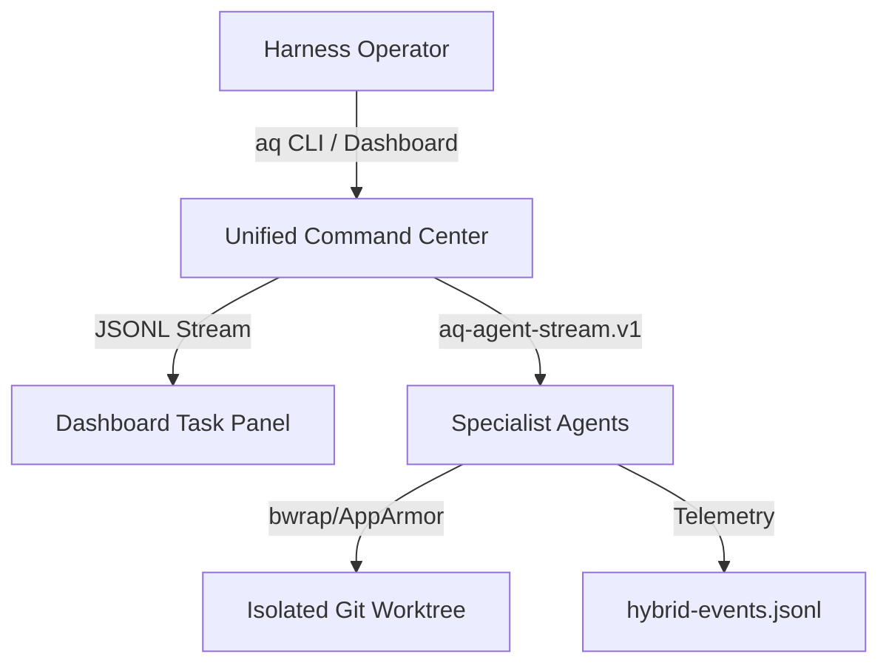

# Verdict

The Antigravity expert-team has reviewed the Zero parity gap analysis and recent harness lessons. We issue a verdict of **PASS** on the usability parity architecture, with the condition that all new CLI and dashboard layers adhere strictly to NixOS declarative boundaries and avoid modifying the canonical 8-step workflow.

# Evidence Read

We have analyzed the following repository references:
- `.agents/plans/parity-gitlawb-zero-2026-07-08.md`
- `.agents/plans/gitlawb-zero-gap-analysis.md`
- `.agents/prompts/TOKENOMICS_PARITY_TEAM_HANDOFF.md`
- `.agents/prompts/CLOUDFLARE_SOFTWARE_FACTORY_PARITY.md`
- `.agent/AQ-CHAT-ROUTING-PRD-CONSOLIDATED.md`
- `.agent/AQ-CHAT-ROUTING-PLAN-CONSOLIDATED.md`
- `.agent/ACTIVATION-AUDIT.md`
- `docs/operations/DASHBOARD-ARCHITECTURE-REFERENCE.md`
- `docs/agent-guides/47-AGENT-TOOL-CONTRACT.md`
- `docs/architecture/role-matrix.md`
- `scripts/ai/delegate-to-antigravity`
- `scripts/ai/aq-chat`
- `scripts/ai/aq-report`
- `scripts/ai/aq-qa`

# Expert-Team Findings

### 1. Product/Operator UX Lead
The biggest usability gap is "opaque execution." When an agent runs, the operator is blind to whether it is stuck in a loop, hitting rate limits, or waiting on a slow local token generation slot. We need real-time, visual task state transitions (idle, running, tool-execution, fallback, complete) showing directly on the dashboard first viewport.

### 2. Dashboard Information Architect
The dashboard lacks a central "Task Activity Panel." The telemetry should display active running PIDs, their logs tail in a terminal-like component, and current token spend. We must replace the hardcoded "--" placeholders with live state sensors connected to the Switchboard and Hybrid Coordinator.

### 3. CLI/Terminal UX Designer
The current CLI experience is fragmented across multiple standalone files (`aq-chat`, `aq-qa`, `delegate-to-antigravity`). We propose a single unified command `aq` with structured subcommands (e.g., `aq run`, `aq status`, `aq doctor`, `aq check`) to give the operator a single, memorable entrypoint.

### 4. Agent-Orchestration Architect
The lack of a standardized JSONL stream protocol prevents deep tooling integrations. We should adopt the `aq-agent-stream.v1` protocol where every tool call, retry, and model transition emits a structured JSON line. This allows both the CLI and dashboard to render identical progress maps.

### 5. Systems/NixOS Implementer
Any new systemd services or CLI bindings must be declaratively defined in `nix/modules/roles/ai-stack.nix`. All temporary workspaces must use clean Git worktrees (`git worktree add`) set up via system temporary directories to avoid working directory contamination.

### 6. Security/Sandbox Reviewer
Sandboxing details are currently opaque. We must introduce `aq-sandbox policy` to output the active AppArmor profiles, bubblewrap arguments, and directories that are readable/writable by the agent. No secret propagation should occur in child tasks.

### 7. Observability/SRE Owner
Telemetry logs are currently scattered. The `hybrid-events.jsonl` and task logs must be consolidated under a central directory with heartbeats written every 5 seconds. If a background PID dies, a watchdog timer must mark the task failed on the dashboard.

### 8. QA/Eval Engineer
We must establish offline prompt/diff test fixtures. Every time we adjust model prompt templates or agent tools, we should run a local suite of 10 static tasks to measure if accuracy or formatting regressions occur.

### 9. Performance/Tokenomics Engineer
Local inference (Qwen3-35B on Renoir APU) is slot-constrained. We must implement aggressive KV-cache sharing and comment/whitespace stripping (minification) before sending file contexts to the LLM to save VRAM and token processing time.

---

*Expert-Team Debate/Disagreement:*
- **Implementer vs. Security Reviewer:** The Implementer proposed allowing quick sandbox bypasses for developer speed. The Security Reviewer rejected this, insisting that any sandbox exceptions must be declared statically in NixOS options. The team agreed: no runtime sandbox bypasses are permitted.

# Ranked Parity Gaps

| Rank | Parity Gap | Operator Value | Implementation Risk | Description |
| :--- | :--- | :--- | :--- | :--- |
| 1 | **Task Progress Transparency** | Critical | Low | Opaque background dispatches lead to operator confusion and premature aborts. |
| 2 | **Unified CLI Entrypoint (`aq`)** | High | Low | Operator must currently memorize 5+ different command paths. |
| 3 | **Provider/Auth Diagnosis (`aq-doctor`)** | High | Medium | Hidden activation issues (expired keys, rate limits) silently break agent loops. |
| 4 | **JSONL Event Stream (`aq-agent-stream.v1`)** | Medium | Medium | Inconsistent task output formats break parsing in dashboard cards. |
| 5 | **Isolated Git Worktrees** | Medium | High | Concurrent agent writes can dirty the main tree or create merge locks. |
| 6 | **Offline Eval Fixtures** | Medium | Low | Prompt changes are currently tested manually, risking silent degradation. |

# Proposed UX Architecture



### Dashboard Navigation & Cards
- **Activity tab:** Displays live running agents, current step, time elapsed, and terminal-like log logs.
- **Provider status tile:** Shows green/red state for Llama.cpp, Qwen pool, and Google Gemini with active billing quota.
- **Sandbox Grants badge:** Shows active AppArmor profile and list of writable/readable paths.

### CLI Command Family
- `aq run <task>`: Run task in a temporary worktree.
- `aq status [task-id]`: Unified state summary (JSONL-parsed).
- `aq doctor`: Diagnose Switchboard, Llama, Postgres, Redis, and secret files.
- `aq abort <task-id>`: Gracefully terminate a PID and clean up its worktree.

### Event Stream / Progress Model
Every run produces an `aq-agent-stream.v1` file:
```json
{"type": "init", "task_id": "antigravity-...", "timestamp": "..."}
{"type": "step", "step": "RESEARCH", "timestamp": "..."}
{"type": "tool_call", "tool": "ctx_read", "path": "...", "timestamp": "..."}
{"type": "fallback", "reason": "HTTP 429", "fallback_profile": "local-coding", "timestamp": "..."}
{"type": "done", "status": "success", "timestamp": "..."}
```

# Slice Plan

### Slice 1: Unified Diagnosis (`aq doctor`)
- **Files touched:**
  - `scripts/ai/aq-doctor` [NEW]
  - `nix/modules/roles/ai-stack.nix` [MODIFY]
- **Acceptance Criteria:** `aq doctor` verifies Switchboard, llama.cpp, PG, Redis, and Sops secret keys, outputting a clean CLI diagnostic table.
- **Validation Commands:** `aq doctor --machine`
- **Dashboard Visibility:** Populates the "Provider Status" card.

### Slice 2: Unified CLI Router (`aq`)
- **Files touched:**
  - `scripts/ai/aq` [NEW]
  - `scripts/ai/aq-chat` [MODIFY]
  - `scripts/ai/delegate-to-antigravity` [MODIFY]
- **Acceptance Criteria:** Operator can call `aq run`, `aq status`, and `aq check` with consistent arguments.
- **Validation Commands:** `aq --help`, `aq status`
- **Dashboard Visibility:** Telemetry reports are sent through a single endpoint.

### Slice 3: JSONL Stream Integration (`aq-agent-stream.v1`)
- **Files touched:**
  - `scripts/ai/lib/task_registry.py` [MODIFY]
  - `assets/dashboard.js` [MODIFY]
- **Acceptance Criteria:** Agent dispatches write versioned JSONL outputs. Dashboard parses the stream in real time.
- **Validation Commands:** `aq status --stream`
- **Dashboard Visibility:** Displays a live, animated stepper card for the running task.

### Slice 4: Isolated Worktree Execution
- **Files touched:**
  - `scripts/ai/lib/worktree.py` [NEW]
  - `scripts/ai/aq` [MODIFY]
- **Acceptance Criteria:** `aq run --worktree` spawns the agent loop inside a clean Git worktree and merges back upon validation.
- **Validation Commands:** `aq run --task "test" --worktree`
- **Dashboard Visibility:** Active worktree location displayed under the task details.

# Validation Matrix

| Target Capability | Automated Test Gate | Manual Verification |
| :--- | :--- | :--- |
| **Harness Diagnostics** | `aq-qa 0` checking `aq doctor` exit code | Running `aq doctor` and inspecting the printout |
| **Command Routing** | Unit tests for CLI subcommand parser | Running `aq status` during an active background job |
| **Event Streaming** | JSONL schema validator against output log | Monitoring the live dashboard Activity tab progress bar |
| **Sandbox Worktree** | Mock runner verifying git worktree deletion | Confirming the main git tree remains clean during edits |

# Risk Register

### 1. Security / Sandbox Risk
- **Description:** Unsafe worktree merge could import malicious or unwanted changes if an agent bypasses validation gates.
- **Mitigation:** Strict pre-merge validation via `tier0-validation-gate.sh` is mandatory. The operator must review the diff before final merge.

### 2. Performance / Token Cost
- **Description:** Real-time logging and stream updates might consume significant CPU and disk write cycles.
- **Mitigation:** Heartbeats are rate-limited to 5-second intervals, and logs are rotated automatically.

### 3. Local Model Latency
- **Description:** Falling back to Qwen3-35B on the Renoir APU runs at 1 token/second, blocking the task queue.
- **Mitigation:** Implement strict task prioritization and allow the operator to cancel local runs from the dashboard.

# First Slice Recommendation

We recommend implementing **Slice 1: Unified Diagnosis (`aq doctor`)** first.
- **Rationale:** A healthy operating system requires a solid diagnosis tool. If the operator cannot verify that credentials, ports, and models are online, building stream telemetry or worktree executors will only mask underlying provisioning failures.
- **Done Criteria:** `aq doctor` successfully detects offline services, missing SOPS keys, and incorrect Switchboard profiles, returning exit code 0 if healthy and exit code 1 on issues.

# Open Questions

1. Should `aq doctor` run automatically on system rebuild (via a NixOS activation script)?
2. Do we want to support remote provider fallback (e.g. OpenRouter) during local Qwen queue saturation, or keep the boundary strictly local-first?

---

VERDICT: PASS — The usability architecture addresses the opaque execution model of background agents and provides a clean, unified command center for operators.
