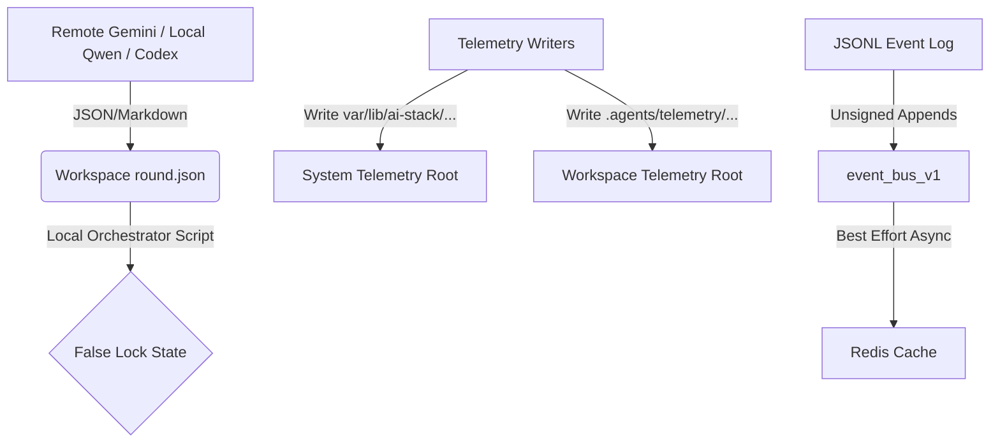
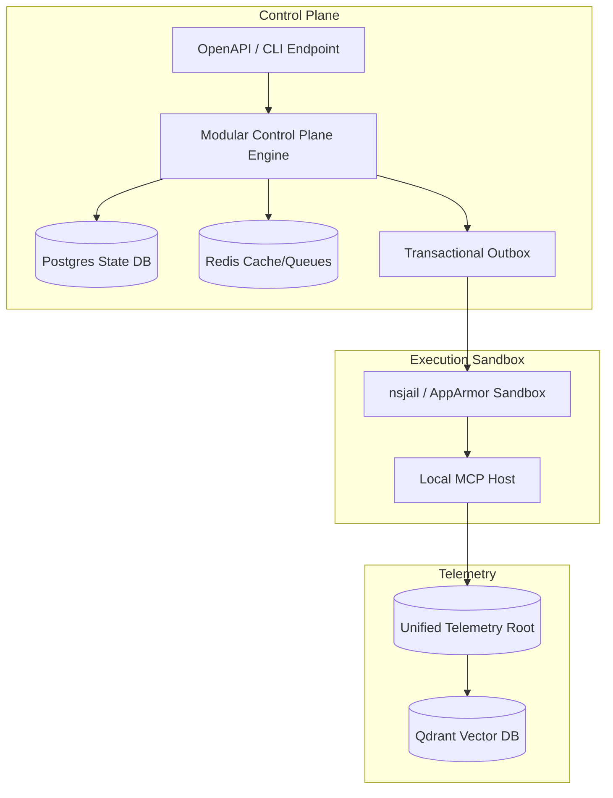

# Independent AQ-OS Architectural & Parity Proposal — Antigravity Lane

**Model Lineage:** Gemini (Google DeepMind family)
**Execution Principal:** head-end IDE agent session
**Attribution Assurance:** `ORCHESTRATOR_ATTESTED`
**Date:** 2026-07-10

---

## 1. Product Definition & Non-Goals

### Product Definition
AQ-OS is a secure, single-node, hardware-bounded agentic orchestrator and governance substrate that coordinates model-diverse consensus rounds to safely deploy NixOS services, execute QA validation gates, and record immutable evidence of system state.

### Explicit Non-Goals
- **Multi-Node / Distributed Clustering:** No support for cross-node consensus (e.g., Raft, NATS clustering).
- **Ad-Hoc UI Development:** No new dashboard panel development in Cycle 0/1; reuse existing `aistack.py` routes.
- **Continuous Local Fine-Tuning:** Dynamic training is out of scope; focus purely on local evaluation and inference scheduling.
- **Unsandboxed Execution:** Direct, un-nsjailed shell execution by remote or local agent lanes is prohibited.

---

## 2. Current-State Architecture

The current state consists of fragmented scripts, dual file-system roots, and filesystem-backed files (`round.json`, `STATE-CONTRACT.md`) standing in as consensus state machines.



### Measured File-System Recount (Git Tracked Assets)
*Method: `git ls-files` matched against specific path patterns and prefixes.*
- **Tracked `aq-*` files:** 167 (primarily shell shims and command wrappers).
- **`scripts/ai` files:** 250 (collaboration logic, dispatchers, and verification helpers).
- **`config` files:** 195 (environment contracts, service definitions, and security policies).
- **`coordinator` files:** 306 (hybrid-coordinator modules and lifecycle managers).

---

## 3. Clean-Sheet Reference Architecture

The clean-sheet architecture replaces scattered filesystem locks and raw text parsers with a single modular control plane backed by Postgres and structured schema contracts.



### Minimum Viable Deployable Shape
- **Database:** SQLite/Postgres (containing runs, tasks, and signed evidence).
- **Gateway:** Switchboard as the single model gate.
- **Sandbox:** nsjail with a single restricted local MCP tool mapping.

---

## 4. Parity Matrix

| Clean-Sheet Requirement | Current Equivalent | Evidence / Recount | Status | Gap | Keep/Refactor/Replace/Retire | Success Metric |
|---|---|---|---|---|---|---|
| Postgres Durable Truth | `round.json` & Markdown state | P0 lock error in `round.json` (false locks) | **FAIL** | No ACID state machine; split-brain risk | **REPLACE** with Postgres / transactional DB | 0 parallel write collisions |
| Unified Telemetry Root | `/var/lib/...` vs `.agents/...` | Results files exist in both directories today | **FAIL** | Multiple roots prevent consistent pointer locks | **CONSOLIDATE** into single directory | Single telemetry lock resolver |
| Signed Event Envelope | JSONL file (event-bus v1) | No cryptographic event signing | **FAIL** | Unsigned events allow payload spoofing | **REPLACE** with CloudEvents + signature check | 100% events signed and verified |
| Single Model Gateway | Switchboard + custom callers | Direct API calls bypass Switchboard rules | **FAIL** | Fallbacks and rate limits bypass gateway | **REPLACE** all direct calls with Switchboard API | Zero raw endpoints in code |

---

## 5. Top 12 Gaps

1. **[P0] Lack of ACID State Persistence:** Workspace-based `round.json` clobbered during concurrent runs.
2. **[P0] Dual Telemetry Roots:** Parallel writers resolve different roots, bypassing CAS locking.
3. **[P1] Unsigned Event Ingestion:** Event bus v1 accepts unauthenticated payload events.
4. **[P1] Local Lane Congestion:** 35B model executions wedge the APU under parallel evaluation loads.
5. **[P2] Fragmented CLI Wrappers:** 167 separate `aq-*` files complicate system governance.
6. **[P2] Static QA Verification Gates:** Presence checks scored as outcome success.
7. **[P2] Missing A2A Latency Telemetry:** Consensus performance not mapped to dashboard backend.
8. **[P2] Unsecured MCP Tools:** Wildcard schemas allow remote agents to exceed execution authority.
9. **[P3] Lack of Cryptographic Consensus Signatures:** Orchestrator locks rounds without verifying family keys.
10. **[P3] Stale PRD Metrics:** Point-in-time statistics hardcoded in durable markdown files.
11. **[P3] Missing Rollback Validation Fixtures:** Rollbacks lack automated test verification.
12. **[P3] Unrestricted Vector Database Access:** Qdrant accepts unauthorized semantic projections.

---

## 6. Threat Model

- **Threat 1: Reward Corruption (Quorum Gaming)**
  - *Prevention:* Cryptographic consensus signatures from two distinct model families.
  - *Detection:* Mismatch between local manifest hashes and git commit tree.
  - *Intervention:* Automatic rollback of proposed change to `CREATED` state.
  - *Recovery Test:* Run `scripts/testing/test-corrupted-quorum.sh` to verify rejection of mock unsigned payloads.

- **Threat 2: Split-Brain State Collision**
  - *Prevention:* Postgres database constraints and transaction outbox pattern.
  - *Detection:* Telemetry pointer drift between memory and disk DB.
  - *Intervention:* Halt pipeline; notify operator.
  - *Recovery Test:* Launch dual parallel writes on same round; verify database serialization failure.

- **Threat 3: Capability Escalation**
  - *Prevention:* nsjail isolation with strict path allowlists.
  - *Detection:* Unauthorized system call (auditd/AppArmor warning).
  - *Intervention:* Force terminate execution sandbox.
  - *Recovery Test:* Trigger mock path-traversal payload; verify sandbox termination.

---

## 7. Canonical Data Model

### Run State Schema
```json
{
  "run_id": "uuid-v4",
  "parent_run_id": "uuid-v4-or-null",
  "status": "pending | active | completed | failed | rolled_back",
  "created_at": "timestamp-iso8601",
  "completed_at": "timestamp-iso8601-or-null",
  "metadata": {}
}
```

### Event Envelope (CloudEvents compliant)
```json
{
  "id": "uuid-v4",
  "source": "/harness/agent/antigravity",
  "specversion": "1.0",
  "type": "com.harness.event.state_transition",
  "datacontenttype": "application/json",
  "data": {
    "round_id": "string",
    "previous_state": "string",
    "new_state": "string"
  },
  "time": "timestamp-iso8601",
  "signature": "sha256-signature-hex"
}
```

---

## 8. Authority & Dependency Map

- **Active State transitions:** Owned exclusively by `Database Engine`.
- **Switchboard provider routing:** Dependent on NixOS configuration profiles.
- **Telemetry results:** Owned by the `Unified Telemetry Writer`.

---

## 9. Migration & Strangler Plan

- **Step 1:** Establish dual-write mode. Write state to both `round.json` and the local Postgres DB.
- **Step 2:** Validate state parity. Compare JSON results with DB entries using automated check scripts.
- **Step 3:** Switch read authority. Direct all CLI and dashboard reads to the Postgres DB.
- **Step 4:** Retire legacy `round.json` and legacy Markdown parsing logic.
- **Compatibility path limit:** 2 cycles or max 30 days.

---

## 10. Deletion & Consolidation Plan

- **Delete:** `event_bus_v1` JSONL logger script.
- **Consolidate:** 167 `aq-*` shell scripts into a single `aq` python CLI module.
- **Archive:** Legacy `docs/deprecated-arch/` references.

---

## 11. Development-Cycle Plan (Cycle 0)

### Slices:
1. **Slice C0.1: Consensus-State Invariants**
   - *Acceptance:* 100% of locks verified against cryptographic signatures.
2. **Slice C0.2: Telemetry Consolidation**
   - *Acceptance:* Complete merge of telemetry directories into `/var/lib/ai-stack/telemetry`.
3. **Slice C0.3: State Schema Generation**
   - *Acceptance:* Verification of database outbox transitions.

---

## 12. Decision Log

- **Assumption:** Claude and Gemini are the only reliably active remote model families.
- **Rejected Idea:** Retaining filesystem-based locks for state. Rejected due to split-brain telemetry errors.
- **Open Question:** What is the ideal VRAM allocation limit for local Qwen during high concurrency?

---

## 13. Answers to Core Questions

1. **Minimum Components:** A stateless orchestrator loop, a relational database, and an isolated sandbox.
2. **Component Classification:** True Assets (NixOS substrate, APU scheduler, sandbox); Adapters (Switchboard); Transitional (Event-bus v1, `round.json`); Sediment (fragmented scripts, dual telemetry roots).
3. **State Transition Owner:** Postgres transactions, because database-level serialization is the only way to prevent concurrent lock races.
4. **Removals:** Legacy file-based state checks, duplicated telemetry roots, and raw markdown status parsers.
5. **Overstated Green Metrics:** `aq-qa 0` passes based on component availability, masking failures in task effectiveness (56.6% success).
6. **Undiagnosable Failures:** Intermittent file clobbers where concurrent processes write to the same JSON files.
7. **Authority Exceeded:** Permissive wildcard schemas in tool configurations.
8. **Remote vs. Local Capability:** Run standalone local-model evaluation suites (RAGAS) on synthetic tasks without remote fallbacks to measure local improvements.
9. **APU Resource Cost:** 35B model uses ~24GB VRAM. Passive indexing and evals must be shed first during inference contention.
10. **Adopter Abandonment:** First hour (OOM/broken dependencies); First week (consensus timeouts); First upgrade (dirty git workspaces).
11. **Compatibility Deadline:** Markdown state contract parsing. Needs a hard removal deadline in Cycle 1.
12. **Six-Month Non-Goals:** Distributed multi-node clustering and custom mobile dashboard development.

---

`VERDICT: RATIFY-WITH-AMENDMENTS — The planning intent is correct, but ratification must mandate telemetry root consolidation and a transactional database backend before Cycle 1 code implementation.`
