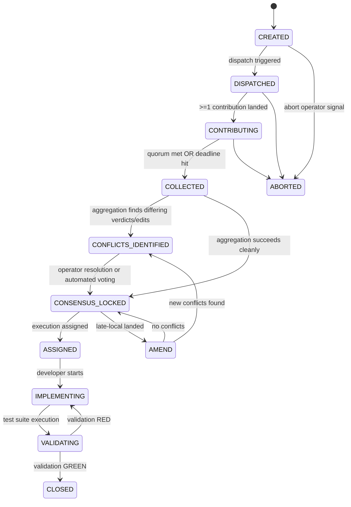

# Antigravity — F1 Design: Durable Typed Round State Machine + Contribution Contract

## 1. Top 3 Design Decisions

1. **State-Locked Lane Idempotency Hashing**: Instead of random GUIDs, every lane dispatch is keyed by a hash of the target manifest and agent payload `idempotency_hash = sha256(round_id + agent_role + task_prompt)`. When the scheduler resumes after process crashes or timeouts, it can safely poll and re-attach without re-triggering inference calls.
2. **Deterministic Late-Local AMEND State**: Local models are slower but essential. If a local model finishes execution after a consensus lock is achieved (transition to `CONSENSUS_LOCKED`), we transition to an `AMEND` state. If the local contribution's verdict matches consensus, it is automatically appended. If it introduces new conflicts, it triggers a consensus roll-back to `CONFLICTS_IDENTIFIED`.
3. **Out-of-Band JSON Sidecars with In-Band Fallbacks**: Standardize validation by requiring a `<agent>.json` sidecar alongside the markdown files. The harness executes a validator scanner. If the sidecar is missing due to a simple-text model crash, a regex-based parser extracts the front-matter block from the final output tokens.

---

## 2. Round Lifecycle State Machine



### Transition Invariants
- **`CREATED → DISPATCHED`**: Initiated only when `round.json` is signed and the target files/branch exist.
- **`CONTRIBUTING`**: Contributions from lanes are immutable once signed and registered.
- **`COLLECTED`**: Quorum requires `min` count met. A lane is marked `pending-late` if active but slow.
- **`CONSENSUS_LOCKED`**: Consensus object signed and hashed. No further file modifications allowed except via `AMEND`.

---

## 3. Schemas

### `round.json` Manifest
```json
{
  "$schema": "https://json-schema.org/draft/2020-12/schema",
  "schema_version": "2.0",
  "round_id": "string (UUID or semantically versioned path)",
  "state": "CREATED|DISPATCHED|CONTRIBUTING|COLLECTED|CONFLICTS_IDENTIFIED|CONSENSUS_LOCKED|ASSIGNED|IMPLEMENTING|VALIDATING|CLOSED|ABORTED",
  "task": {
    "prompt": "string",
    "target_branch": "string",
    "scope_files": ["string"]
  },
  "quorum_policy": {
    "min_lanes": 2,
    "required_agents": ["reviewer"],
    "late_local_admissible": true
  },
  "deadline": "string (ISO8601)",
  "lanes": [
    {
      "agent": "string",
      "dispatch_id": "string",
      "idempotency_hash": "string (sha256 of parameters)",
      "status": "pending|running|submitted|failed|timeout|pending-late",
      "landed_at": "string (ISO8601) OR null"
    }
  ],
  "consensus_hash": "string (sha256 of merged contributions) OR null",
  "history": [
    {
      "transition": "string",
      "timestamp": "string",
      "actor": "string"
    }
  ]
}
```

### Contribution Envelope (`<agent>.json`)
```json
{
  "schema_version": "2.0",
  "agent_id": "string",
  "model_provenance": {
    "model_name": "string",
    "model_version": "string",
    "parameters": {
      "temperature": 0.0,
      "max_tokens": 1000
    }
  },
  "verdict": "APPROVE|APPROVE_WITH_CHANGES|REJECT|ABSTAIN",
  "required_changes": [
    {
      "file_path": "string",
      "line_range": "string (e.g. 12-25)",
      "description": "string",
      "severity": "critical|minor"
    }
  ],
  "anchors": ["string (critical code symbols audited)"],
  "metrics": {
    "latency_ms": 120,
    "tokens_input": 2045,
    "tokens_output": 512
  },
  "signature": "string (local public key validation)"
}
```

---

## 4. Idempotency & Quorum Rules
* **Double-Dispatch Prevention**: The orchestration coordinator verifies if `idempotency_hash` matches a registered lane entry in `round.json` before triggering a new shell/API deployment.
* **Late-Local Admissibility**:
  - If state is `CONSENSUS_LOCKED` and a contribution is received from `local`:
    - Transit to `AMEND`.
    - If `contribution.verdict == consensus.verdict` AND the `required_changes` match or are subsets of locked changes, append the local telemetry and transition back to `CONSENSUS_LOCKED`.
    - If `contribution.verdict == REJECT` or it demands new `required_changes` not in consensus, transition to `CONFLICTS_IDENTIFIED` to require operator decision or automated voting.

---

## 5. Aggregation Algorithm
1. Parse all files matching `<agent>.json` in the round folder.
2. Filter active files by checking against registered lanes in `round.json`.
3. Compute Verdict Tally:
   - If any `REJECT` exists on a critical file, mark aggregated status as `CONFLICTS_IDENTIFIED` unless overridden by quorum.
4. Merge `required_changes`:
   - Match by `file_path`. If changes overlap on lines:
     - If both changes are structurally identical, merge (retaining both authors).
     - If changes recommend conflicting edits (e.g. different mock approaches), flag as a `CONFLICT` item.
5. Merge `anchors` and `risks` into a unified list.
6. If 0 conflicts remain, write `consensus.json` and transition `round.json` to `CONSENSUS_LOCKED`.
7. Else, write `conflicts.json` listing overlaps and transition `round.json` to `CONFLICTS_IDENTIFIED`.

---

## 6. Golden ROUND Test Cases
- `test_clean_lock`: Every lane submits `APPROVE` within the deadline; manifest locks cleanly.
- `test_idempotent_retry`: Worker process crashes mid-round, restarts, and skips already executed lanes.
- `test_late_local_concurrence`: Late local submission arrives post-lock, is verified as concurring, and merges with no state disruption.
- `test_late_local_conflict`: Late local submission demands changes; manifest enters `CONFLICTS_IDENTIFIED` state.
- `test_quorum_timeout`: Deadline hits; required reviewers have submitted but some background ones timed out; quorum handles it by marking dead lanes and compiling consensus.
- `test_invalid_schema`: Verify sidecar parser rejects malformed inputs gracefully.
