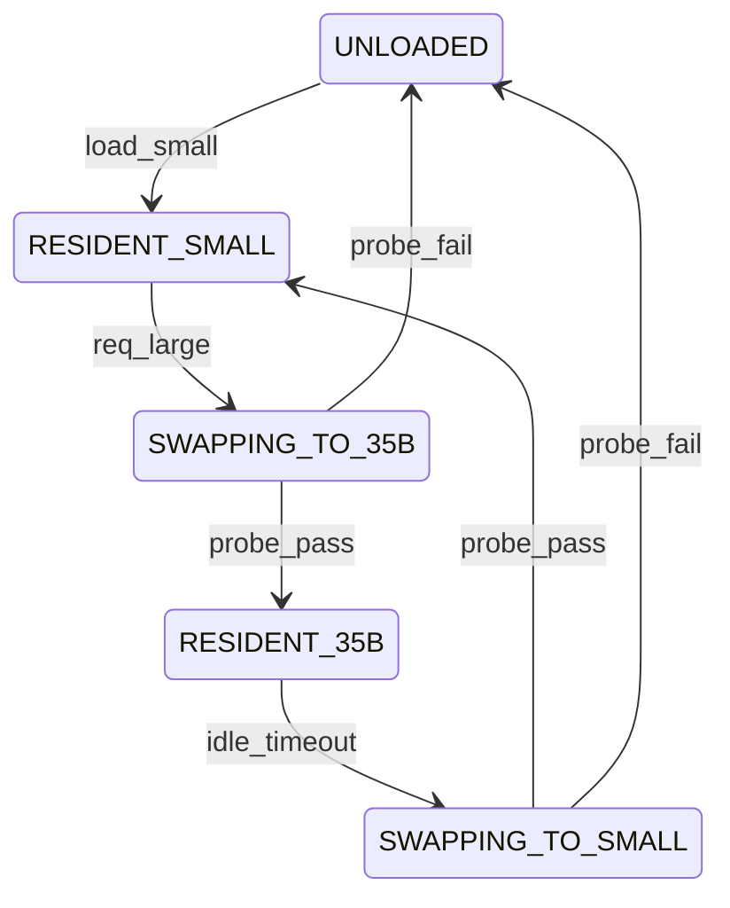

# Antigravity Review — F2.5 35B Session-Mode Load/Unload

## Verdict: APPROVE_WITH_CHANGES

We support the (A) Mutual Exclusion model as the default, safest baseline. Co-residency (35B on CPU + Small on GPU) must remain gated behind the F2.6 A/B evaluation numbers, because exceeding our strict physical hardware constraints risks system instability.

---

## 1. Concrete Answers & Substrate Design

### 1. Trigger Authority & Condition
- **Authority**: A lightweight controller daemon (`aq-swap-controller`). It acts as the local gen-slot coordinator.
- **Trigger**: 
  - **Load 35B**: A task requiring `LARGE_SESSION` arrives at `dispatch.py` -> `dispatch.py` queries `/swap/status` -> If `RESIDENT_SMALL`, the controller transitions to `SWAPPING_TO_35B` and triggers the swap.
  - **Unload 35B**: When `RESIDENT_35B` is idle (no `LARGE_SESSION` requests for `idle_unload_timeout_seconds` (default: 90s)), the controller unloads the 35B.

### 2. In-flight Request Handling & Process Eviction
We must challenge the assumption that `:8080` (35B) and `:8082` (Fast-Lane Small) can operate concurrently.
- **RAM Math**: 22.5GB (35B) + 1.0GB (KV) + 2.5GB (Small Model) + 3.0GB (OS) = 29.0 GB. This directly exceeds the physical 27 GB ceiling and will trigger kernel OOM event.
- **Eviction Rule**: Eviction of the small model (stopping `:8082` service) when the 35B is loaded is **mandatory**. We cannot run these processes concurrently.
  - When swapping to 35B: Stop `:8082` first -> Swap symlink -> Start `:8080`.
  - When swapping to Small: Stop `:8080` -> Swap symlink -> Start `:8082`.

### 3. Swap Cooling as Back-Pressure
We model swap cooling via `backpressure.py`. If a swap occurred less than `cooling_window_seconds` (default: 30s) ago, any new request targeting the swap-out model gets returned immediately as `LOCAL_DELAYED`. This prevents thrashing or rapid startup cycles.

### 4. Gen-slot State Machine
The state machine is persistent and written to `/var/lib/nixos-ai-stack/optimizer/gen-slot-state.json`.

### 5. Failure / Mid-Swap Recovery
- **Watchdog / Reaping**: If a transition probe fails or times out, the controller stops both service systemd units, validates that all subprocesses are dead, unlinks `/var/lib/llama-cpp/models/active.gguf`, resets state to `UNLOADED`, and raises a high-severity alert.

### 6. Process Control & Reuse
We must reuse the existing `aq-model-switch` script. We extend it with:
- `aq-model-switch unload`: Stops the gen-slot service and unlinks `/var/lib/llama-cpp/models/active.gguf` to release allocations.

---

## 2. Top 3 Design Decisions
1. **Mandatory Process Eviction**: We forbid concurrent execution of `:8080` and `:8082` processes; when one is loaded, the other must be stopped to avoid OOM.
2. **Reuse aq-model-switch**: Extend the existing symlink-switching tool with the `unload` option instead of adding custom process-creation wrappers.
3. **State Machine Persistence**: Gen-slot states must be persisted as JSON to survive daemon crashes or system restarters.
