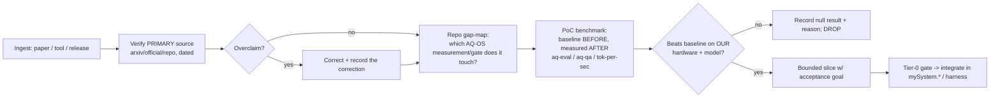

# Frontier-Evidence Intake — executable loop, not a reading list

**Status:** PREPARED_ONLY / design — resumes Codex's frontier-evidence lane after its session limit
(2026-09-07). Awaiting orchestrator + independent review before any slice is scheduled.
**Codex's framing (adopted):** "this needs to become an executable intake loop, not a growing 'interesting
papers' list. One independent researcher verifies current primary sources; one repo auditor maps only
evidence-backed techniques to existing AQ-OS measurements, acceptance gates, and bounded future slices;
overclaims are corrected before anything enters the roadmap."
**Owner directive:** constantly fold the latest AI developments into active dev/slices — with 2026 primary
sources, not just 2023–2025.

## 1. The loop (executable, benchmark-gated, anti-gaming)

Hard rules folded in:
- **Never adopt without a baseline** (owner directive + our own governing principle "you cannot manage what
  you cannot measure"). A null/negative result is a first-class output, recorded, not hidden (anti-gaming).
- **Primary source or it doesn't count.** Blog syntheses (incl. the Gemini synthesis that seeded this) are
  leads, never evidence. Verify against arxiv / official repo / spec, dated.
- **Measured on OUR regime.** A technique's headline speedup on an RTX-4090 says nothing about our Renoir
  APU + Qwen3.6-35B-A3B MoE. Benchmark on the target before it enters the roadmap.
- **Agent-agnostic roles (Rule 18).** "Independent researcher" and "repo auditor" are role instances routed
  to any eligible lane; never permanently one model.

## 2. First cycle — verified evidence map (2026 primary sources)

Legend: ✅ adopt-candidate · 🟡 monitor · ❌ overclaim corrected / not applicable now.

| # | Technique | Verified 2026 status (primary source) | AQ-OS existing measurement / mechanism | Verdict + bounded slice |
|---|---|---|---|---|
| F-1 | **Test-time compute + Process Reward Models** | AgentPRM (ACM Web Conf 2026) = step-wise promise/progress, >8× compute-efficiency; GenPRM-7B adds code-execution verification; "Scaling TTC to IOI Gold with open-weight models" (arXiv 2510.14232, Oct 2025). | Our aq-qa / Tier-0 ARE execution verifiers; edit-verify + behavioral-verify coach already score local-agent steps. | ✅ **Slice FE-1:** treat aq-qa/behavioral-verify as a lightweight PRM signal for the local agent-loop — score intermediate edits, prefer a verified branch before commit. Acceptance: measured pass-rate lift on the dogfood set, no latency blow-up on the APU. |
| F-2 | **DSPy / GEPA prompt compilation** | GEPA (ICLR 2026): gradient-free, natural-language-reflection optimizer; +20% vs GRPO with **35× fewer rollouts**; ~13% over MIPROv2. Real prod: Microsoft MAI uses GEPA/DSPy to optimize a **Qwen3-30B judge prompt**. | We have execution verifiers (aq-qa) + a local Qwen judge/coach + `shared/llm_config.py` prompt SSOT. | ✅ **Slice FE-2:** GEPA as an **offline, build-time** prompt-compile step for harness prompts, gated by aq-qa (adopt the compiled prompt only if it beats the current one on the gate). NOT a runtime dep (DSPy's known prod gap: the optimizer runs offline then disappears). Acceptance: a compiled local-agent prompt that raises tool-call/edit success on the eval set. |
| F-3 | **MCP + A2A interop standards** | MCP spec 2025-11-25, ~97M monthly SDK downloads by Feb 2026, adopted by all major providers. A2A v1.0 (Apr 2026), donated to Linux Foundation, 150+ orgs, de-facto inter-agent standard. Governance paper (arXiv 2606.31498): MCP/A2A/ACP cannot express key governance. | We already run MCP (hybrid-coordinator, lean-ctx) and a home-grown signed-A2A (Foundation F3) + capability leases. | 🟡 **Slice FE-3 (design):** gap-check our signed-A2A against A2A v1.0 for interop + adopt its task/stream envelope where it doesn't weaken our governance. NOTE we are AHEAD on governance (capability leases express what the standards "cannot express") — keep that, don't regress to a looser standard. |
| F-4 | **Speculative decoding** | Measured 2026: gains **tens-of-% to ~2×**, not 2–3× universal; CPU-only 1.72× (2.03× on math); **no positive yield on consumer Ampere + Q4 target**; and a direct test on **Qwen3.6-35B-A3B (our model) + RTX 3090 found NO mode faster than baseline** (MoE with ~3B active is already fast per-token). | Our model IS Qwen3.6-35B-A3B on an APU; tok/s is measured (~4.9 resident). | ❌ **Corrected overclaim.** Gemini's "pair with a 1B/3B draft for 2–3×" does **not** transfer to our MoE/APU regime. **Do NOT schedule** a spec-decode slice for the current model; re-test only if we switch to a dense model. Recorded as a null-candidate. |
| F-5 | **BitNet / 1.58-bit ternary** | BitNet b1.58-2B-4T (Apr 2025, native-trained) + a Llama3-8B-1.58 (100B tok), 0.7B/3.3B, Falcon3 1.58. **Requires native training — NOT post-hoc quantization.** Largest open native 1-bit models top out well below the best 4-bit-quantizable models; "for the most capable model your hardware can hold, 4-bit wins today." | We run Qwen3.6-35B Q5_K_S; ceiling is RAM/VRAM, not bit-width policy. | ❌ **Corrected overclaim.** Gemini's "30B+ in 8–12GB VRAM with minimal loss" is false in 2026 — **no native 1-bit 30B exists**, and you can't ternary-quantize our Qwen post-hoc. 🟡 **Monitor** (native models are scaling); our Q4/Q5/IQ path stays correct. Aligns with the owner's standing decision to keep Qwen Q5, not chase a lighter model. |
| F-6 | **KV-cache compression (H2O / SnapKV)** | Established (2023–24) heavy-hitter/attention-based eviction; 2026 work continues. Value is context-length headroom under memory pressure. | Our KV floor is a measured reserve (1GB) in the AI-fit policy; APU RAM is the binding constraint. | 🟡 **Monitor / measure-first.** A real candidate ONLY if a benchmark shows longer usable context on the APU without quality loss. No slice until measured. |
| F-7 | **Declarative impermanence / ephemeral root** | NixOS impermanence + disko are mature 2026 patterns (root on tmpfs; persist /nix,/var/lib,/home). | We ALREADY have `mySystem.aiStack.impermanence` (flake input wired, enable-flag guarded). | ✅ Already integrated (design-present, default-off). Fold into the golden-profile / P4 bare-metal path as an opt-in, not net-new research. |
| F-8 | **Zero-trust sandboxing (Landlock / eBPF / cgroup v2)** | Mature 2026 LSM/eBPF stack; governance papers confirm protocol-layer gaps that runtime sandboxing must cover. | We ALREADY run bwrap cells + AppArmor + capability leases + C6 epoch-fence. | ✅ Mostly integrated. Bounded add: a **Landlock/eBPF egress pin** for untrusted MCP servers (e.g. restrict a tool to 127.0.0.1) — attaches to Foundation-C activation evidence. Measure: deny-closed proof + no regression. |

## 3. Overclaims corrected (before anything entered the roadmap)
1. **BitNet "30B+ in 8–12GB VRAM, minimal loss"** → false in 2026: native-trained only, largest open native
   1-bit models are far below 30B, and existing Qwen cannot be ternary-quantized post-hoc. 4-bit still wins.
2. **Speculative decoding "2–3× on local"** → tens-of-% to ~2× at best, negative on some configs, and
   specifically **no gain on our Qwen3.6-35B-A3B**. Not universal; regime-dependent.
3. **DSPy "runtime pipelines"** → the optimizer is an **offline compile step**; adopt the compiled prompt,
   not a runtime dependency (the known DSPy production gap).
These are recorded so the corrections survive session resets (institutional-memory rule).

## 4. Scheduling
- Near-term adopt-candidates (measure first): **FE-1** (PRM-as-verify signal), **FE-2** (GEPA build-time
  prompt compile), **FE-8** (Landlock egress pin). Each needs a baseline benchmark before it becomes a slice.
- Monitor: **FE-3** (A2A v1.0 interop), **FE-5** (native 1-bit), **FE-6** (KV compression).
- Dropped now: **FE-4** (spec-decode for the current MoE) — re-test only on a dense-model switch.
- The loop itself is standing: each new paper/tool/release re-enters at box A, and a null result is a valid,
  recorded outcome.

## 5. Sources (primary, verified 2026-09-07)
- Test-time compute / PRMs: arXiv 2510.14232 (Scaling TTC to IOI Gold, open-weight); AgentPRM (ACM Web Conf
  2026); GenPRM arXiv 2504.00891.
- GEPA/DSPy: dspy.ai GEPA overview + gepa-ai/gepa (ICLR 2026 result); Microsoft MAI GEPA/Qwen3-30B judge.
- MCP/A2A: MCP spec 2025-11-25; A2A v1.0 (Apr 2026, Linux Foundation); governance gaps arXiv 2606.31498.
- Speculative decoding: ggml-org/llama.cpp discussion #10466 + docs/speculative.md; measured null result on
  Qwen3.6-35B-A3B (community bench, 2026).
- BitNet: microsoft/BitNet + microsoft/bitnet-b1.58-2B-4T (HF); arXiv 2504.12285.
