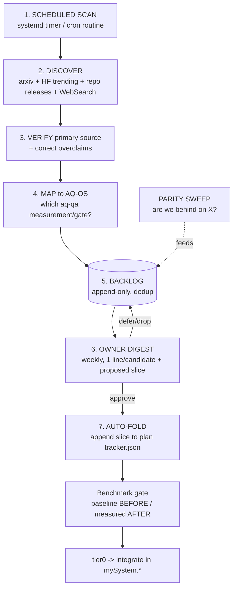

# Frontier Autopilot — automated research → PRD/plan/goal folding (no re-prompting)

**Status:** PREPARED_ONLY / design. Answers the owner's standing ask: *"how do we automatically fold new AI
frontier research into our PRDs, plans, validations, and goals — so we don't fall behind and I don't have to
constantly re-PRD or re-prompt the research loops?"*
**Relationship:** this is the AUTOMATION layer over [[frontier-evidence-intake/DESIGN.md]] (the manual loop).
It reuses the same verify→map→benchmark→gate discipline, wrapped in a scheduler + a durable backlog + a
one-glance owner digest + auto-projection into the PM trackers. Mirrors the existing closed learning loop
(capture→correct→HITL-approve→ingest) — the proven pattern here, applied to EXTERNAL research.

## The problem with a manual loop
Today a human must prompt "go research X, check parity, fold it in." That doesn't scale and it rots the
moment attention lapses. The fix is a standing loop that runs on a clock, surfaces only a short approval
digest, and updates the plans itself once approved — the human reviews deltas, never re-drives the search.

## Architecture (7 stages, all reusing existing harness pieces)

1. **Scheduled scan (the clock).** A recurring trigger — two options, pick per lane availability:
   - *Local-first:* a NixOS `systemd.timer` (weekly) that enqueues a `frontier-scan` task for the next
     eligible web-capable lane (Rule 18 routing) — declarative, offline-scheduled, runs when a lane is up.
   - *Cloud routine:* a `schedule`/CronCreate routine that wakes a web-capable agent weekly.
   The scan is a bounded prompt: "run the intake loop over the source set; append verified candidates."
2. **Discover.** Curated source set (versioned in `sources.yaml`): arxiv categories (cs.AI/cs.CL/cs.LG),
   HuggingFace trending (via the HF MCP already attached), key repo releases (llama.cpp, vLLM, DSPy/GEPA,
   BitNet, MCP/A2A specs), and targeted WebSearch. New sources are added to the file, not re-prompted.
3. **Verify + correct.** Every lead resolved to a dated primary source; overclaims corrected (as done this
   cycle: BitNet-30B, spec-decode-on-A3B, DSPy-runtime). Blog syntheses are leads, never evidence.
4. **Map to AQ-OS.** Each verified technique tagged with the existing measurement/gate it touches
   (aq-qa, aq-eval, health-spider, capability leases, …) and whether we already have it, are ahead, or have
   a gap. No mapping → no slice.
5. **Backlog (durable, dedup).** `BACKLOG.jsonl` — append-only records {id, source, claim, verdict,
   aqos_mapping, proposed_slice, acceptance_goal, status}. Dedup by content hash so re-scans don't spam.
   Survives session resets (institutional-memory rule).
6. **Owner digest (HITL, one glance).** A generated weekly digest (dashboard card + a short MD): "N new,
   K overclaims corrected, here is the 1-line proposed slice + acceptance goal for each." Owner approves /
   defers / drops per item with one action — this is the ONLY human touchpoint, and it reviews deltas, not
   raw papers. Reuses the Approval Control Plane pattern (plain-language, HITL-gated).
7. **Auto-fold into planning.** An APPROVED candidate is appended by the tool as a slice item to the
   relevant plan's `tracker.json` editorial (goal + deps + validation_goal + detection signals). The PM
   projector (`aq-pm-tracker`) then shows it in the gantt/kanban automatically — the plan/goals update
   WITHOUT a hand-written PRD. Status stays PROJECTED from git (anti-gaming); the human never types status.

Cross-cutting:
- **Benchmark gate (measure-first).** No candidate flips to "adopted" without a baseline BEFORE + measured
  AFTER on our hardware+model (aq-eval/aq-qa) — the rule that caught FE-4 (spec-decode) and FE-2 (metric).
- **Parity sweep.** A periodic reverse check: for each pillar (agent arch, context/memory, local MLOps,
  OS/security), compare our implemented state vs the current frontier and emit "behind on X" gaps into the
  backlog — this is the "am I falling behind?" alarm, automated.

## Build path (phased, each a bounded slice)
- **FA-1 (foundation):** `sources.yaml` + `BACKLOG.jsonl` schema + an append/dedup library + `aq-frontier`
  CLI (add-candidate, list, digest). Pure data+CLI, no scheduler yet. Testable offline.
- **FA-2 (digest + HITL):** the weekly digest generator + a dashboard "Frontier" card; owner
  approve/defer/drop writes status back to the backlog.
- **FA-3 (auto-fold):** approved candidate → `tracker.json` slice append (projected by aq-pm-tracker); a
  tier0 check that every backlog item marked "scheduled" has a real tracker slice (fail-closed).
- **FA-4 (scheduler):** the systemd timer (or cron routine) that runs the scan on a clock and routes to a
  web-capable lane; kill switch + owner-visible cadence.
- **FA-5 (parity sweep):** the reverse gap check per pillar.
Each phase measures before/after and gates on tier0. FA-1 is the honest first slice.

## Why this is trustworthy (not a hype-chaser)
- Primary-source-only + overclaim correction keeps garbage out.
- Measure-first + tier0 keeps unproven techniques out of production.
- HITL digest keeps the owner in control with minimal effort (deltas, not drives).
- Projected planning keeps goals honest (no hand-typed status).
- Agent-agnostic roles keep it running when any single lane is down.

## Next
Owner decision: local systemd timer vs cloud routine for FA-4 (the clock), and cadence (weekly default).
FA-1 (sources + backlog + `aq-frontier` CLI) is buildable now, offline, non-colliding — the honest first
slice that turns this design into a running loop.
