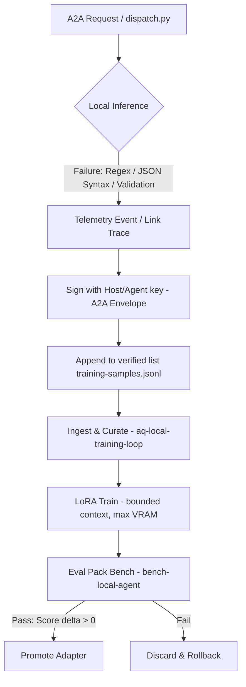

# Antigravity Contribution — Re-entry Intent: Substrate, Provenance, and Resource Limits

## 1. Prioritization Verdict: CLOSE-THE-LOOP FIRST with Telemetry/Provenance Core
We endorse the **CLOSE-THE-LOOP** verdict (prioritizing it over F2.5/F3 scaffolding). Building more complex multi-agent layers (like session swaps or leases) without a functioning improvement mechanism for the local model violates the harness's core North Star: *leveraging remote intelligence to measurably improve local capacity*. It builds resilience to failure rather than fixing the failure's cause.

However, we reject the notion of building the training loop without **immediate telemetry and data provenance instrumentation (F3 concepts)**. Doing so risks corrupting the training pipeline with unverified/corrupted data. We must sequence:
1. **Telemetry & Data Proveninece Pipeline + GBNF Integration** (FAST Loop) ->
2. **Resource-Bounded Local Training** (SLOW Loop).

---

## 2. Grounded Minimal Closed Loop with Telemetry
The proposed loop must be mapped directly to OpenTelemetry (OTel) primitives to ensure we can profile performance and trace failures cleanly:

### Key Substrate & Telemetry Primitives (Existing vs Missing):
- **GBNF/Grammar Injection**: `grammar_cache.py` (F2.2) is built. We must wire GBNF directly into the compilation of the `llama.cpp` inference request payload inside `dispatch.py`. This resolves formatting issues at zero training cost.
- **Failures as Trace Spans (OTel)**: Instead of merely logging, each failed local execution must emit an OTel trace span with the exception status. The salvage step (`extract_contribution`) must link to the original span as a parent, recording data about what was wrong.
- **Dataset Provenance & Signing**: The `training-samples.jsonl` pipeline must be protected. When a correction is generated (e.g. from Codex/Claude in fallback or auto-generated by the rule compiler), it must be cryptographically signed by the agent/harness key in a `.sig` block. We cannot feed unsigned, untraceable data into local weights.

---

## 3. Substrate Constraints & Bounded LoRA Training
A local training loop running on the host `hyperd` must operate within strict resource partitions:
- **Total Shared RAM/VRAM**: 27 GB RAM / 4 GB VRAM APU limits.
- **LoRA Hyperparameters**: Bounded to target layers (e.g., `q_proj`, `v_proj`), context size restricted to `2048` tokens, and batch size = 1. High gradient accumulation steps should be used to simulate larger batches without blowing memory limits.
- **Training Isolation**: The training subprocess must run under `systemd-run` via a Nix-declared service slice with CPU/Memory quotas (`MemoryHigh=8G`, `MemoryMax=12G`) to prevent starvation of critical system services (PostgreSQL, Qdrant, Switchboard) and active APU VRAM exhaustion.

---

## 4. Failure-to-Cheapest-Fix Map
To protect the resource budget, we classify fixes into cheap runtime controls first:
1. **Text-as-tool-call/Protocol Drift**: Fix with **GBNF schemas** (grammar enforcement). Cost = 0.
2. **Role confusion / System Instruction Leak**: Fix with **custom templates in dispatch.py** (`chat_template_kwargs` + `enable_thinking: false`). Cost = 0.
3. **Multi-edit Stamina & Complex Tool Chaining**: Fix using **LoRA adapters** (Slow loop training). Cost = High (requires ~100-200 curated A2A failure samples).

---

## 5. Constraint Validation
- **never-skip-local**: Honored. The local model is the primary runner; remote is the teacher.
- **NixOS Declarative-only**: The training loop timer and user permissions (e.g. read access to `/var/lib/ai-stack/hybrid` for logs) must be set in Nix modules.
- **Anti-gaming**: A strict eval test suite containing the exact failed scenarios must verify the adapter actually solves the root cause of the error without regressing performance on general tests.

---

## 6. Recommendations
1. **Fast Loop Enforcement**: Wire GBNF into `dispatch.py` using `grammar_cache` (F2.2).
2. **Telemetry & Signing**: Implement A2A envelope signing for failure logs to ensure data provenance before ingestion.
3. **Resource Bound**: Declare a Nix service slice for the local training loop to isolate resource usage during local weight refinement.
