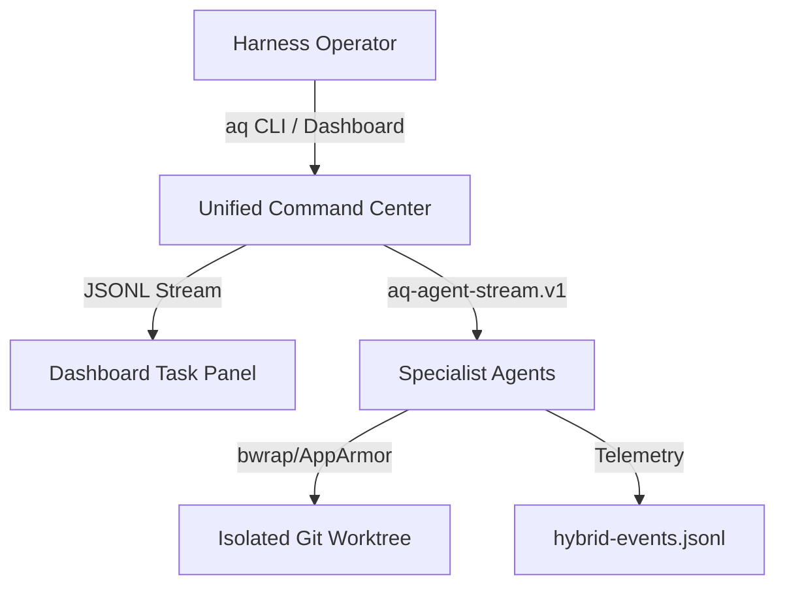

# Verdict

PASS-WITH-CONDITIONS. The usability parity architecture should proceed, provided that the first implementation slice focuses strictly on the background delegation visibility and the `background_task.v1` heartbeat protocol under the harness's strict OAuth-only credentials policy.

# Evidence Read

We have analyzed the following repository references:
- `.agents/prompts/AI_HARNESS_USABILITY_PARITY_EXPERT_TEAM_PROMPT.md`
- `.agents/plans/usability-parity-v2/README.md`
- `.agents/plans/usability-parity-v2/claude.md`
- `.agents/plans/usability-parity-v2/codex.md`
- `.agents/plans/usability-parity/antigravity.md` (previous draft)
- `.agents/prompts/TOKENOMICS_PARITY_TEAM_HANDOFF.md`
- `scripts/ai/aq-collab-round`
- `scripts/ai/delegate-to-antigravity`
- `ai-stack/switchboard/switchboard.py`
- `lib/l4-coord/agents/collaborative_planning.py`
- `docs/operations/DASHBOARD-ARCHITECTURE-REFERENCE.md`
- `docs/agent-guides/47-AGENT-TOOL-CONTRACT.md`
- `docs/architecture/role-matrix.md`

# Expert-Team Findings

### 1. Product/Operator UX Lead
The primary usability blocker is "opaque background execution." When a background task is delegated (such as via `delegate-to-antigravity`), the operator has no real-time status indicating if the task is processing, stalled, hitting API rate limits, or waiting on a slow local token generation slot. We need real-time visual transitions showing execution phases on the dashboard.

### 2. Dashboard Information Architect
The current dashboard lacks a central panel showing active agent tasks. The telemetry must display running process IDs (PIDs), their active lane allocations (e.g., local Qwen, Codex, Antigravity), and live progress/heartbeats. All blank "--" status fields must be wired to dynamic telemetry sensors.

### 3. CLI/Terminal UX Designer
The command-line tools are fragmented (`aq-chat`, `delegate-to-antigravity`, `aq-qa`). We propose a single unified command router `aq` with subcommands (e.g., `aq run`, `aq status`, `aq doctor`) to give the operator a single, memorable entrypoint with consistent argument schemas.

### 4. Agent-Orchestration Architect
The system requires a standardized event envelope to coordinate local and remote models. We should adopt the `background_task.v1` heartbeat protocol and `aq-agent-stream.v1` JSONL event stream format to serve as the unified telemetry adapter layer across all agent lanes.

### 5. Systems/NixOS Implementer
All new systemd services (e.g., drop-zone watches) and directories must be declaratively defined in `nix/modules/roles/ai-stack.nix`. All temporary workspaces must use clean Git worktrees (`git worktree add`) to avoid polluting the main git tree.

### 6. Security/Sandbox Reviewer
Strict credentials isolation must be maintained. The Antigravity lane must rely exclusively on IDE OAuth credentials; no SOPS keys or direct API keys may cross the boundary. AppArmor denials and sandboxed tool execution boundaries must be visually auditable.

### 7. Observability/SRE Owner
Heartbeats must be written to task metadata registry rows and event streams every 5 seconds. If a background PID terminates unexpectedly, a watchdog timer must automatically mark the task as failed on the dashboard.

### 8. QA/Eval Engineer
We must establish offline prompt/diff test fixtures. Every time we adjust model prompt templates or agent tools, we should run a local suite of 10 static tasks to measure if accuracy or formatting regressions occur.

### 9. Performance/Tokenomics Engineer
Local inference (Qwen3-35B on Renoir APU) is slot-constrained. We must implement KV-cache sharing and comment/whitespace minification to optimize processing times, and expose these metrics on the telemetry stream.

---

*Expert-Team Debate/Disagreement:*
- **Implementer vs. Security Reviewer:** The Implementer proposed enabling quick sandbox bypasses for developer convenience. The Security Reviewer rejected this, insisting that all sandbox permissions must be statically declared in NixOS module profiles. The team agreed: no runtime sandbox bypasses are permitted.

# Ranked Parity Gaps

| Rank | Parity Gap | Operator Value | Implementation Risk | Description |
| :--- | :--- | :--- | :--- | :--- |
| 1 | **Background Task Progress Visibility** | Critical | Low | Opaque background dispatches lead to operator confusion and premature aborts. |
| 2 | **Standardized Heartbeat Protocol (`background_task.v1`)** | Critical | Low | Lack of uniform heartbeats leaves dead/hung processes reported as "running". |
| 3 | **Provider Auth Diagnostic Deficit** | High | Medium | Hidden connection and authentication issues silently break agent loops. |
| 4 | **Strict OAuth Credentials Isolation** | High | Low | Risk of credential leakage or incorrect key fallback on OAuth-only lanes. |
| 5 | **Missing Dashboard Task Stepper Card** | High | Low | Dashboard lacks a centralized view of live task progression and logs. |
| 6 | **JSONL Stream Standardization (`aq-agent-stream.v1`)** | Medium | Medium | Inconsistent event formatting across agents breaks unified parser integrations. |
| 7 | **Drop-Zone Exception/Queue Visibility** | Medium | Low | Asynchronous drop events are invisible until processed, leading to silent drops. |
| 8 | **Dormant Scheduler Telemetry** | Medium | Low | Built-in backpressure and queue management controls are opaque to the operator. |
| 9 | **Sandbox/AppArmor Permission HUD** | Low | Medium | Denied capability grants are hidden, making tool failure debugging slow. |
| 10 | **Lack of Parallel Workspace Isolation** | Low | High | Concurrent runs share the main workspace, causing dirty trees and merge conflicts. |

# Proposed UX Architecture



### Dashboard Navigation & Cards
- **Activity Tab:** Displays live running agents, current step, time elapsed, and terminal-like logs.
- **Provider Status Tile:** Shows green/red state for Llama.cpp, Qwen pool, and the Antigravity IDE/OAuth inbox lane without exposing or requiring API keys.
- **Sandbox Grants Badge:** Shows active AppArmor profile and list of writable/readable paths.

### CLI Command Family
- `aq run <task>`: Run task in a temporary worktree.
- `aq status [task-id]`: Unified state summary (JSONL-parsed).
- `aq doctor`: Diagnose Switchboard, Llama, Postgres, Redis, and OAuth/inbox lane readiness without reading or printing secrets.
- `aq abort <task-id>`: Gracefully terminate a PID and clean up its worktree.

### Event Stream / Progress Model
Every run produces an `aq-agent-stream.v1` file:
```json
{"type": "init", "task_id": "antigravity-...", "timestamp": "..."}
{"type": "step", "step": "RESEARCH", "timestamp": "..."}
{"type": "tool_call", "tool": "ctx_read", "path": "...", "timestamp": "..."}
{"type": "fallback", "reason": "HTTP 429", "fallback_profile": "local-coding", "timestamp": "..."}
{"type": "done", "status": "success", "timestamp": "..."}
```

# Slice Plan

### Slice 1: Delegation Visibility & Heartbeat Protocol
- **Files touched:**
  - `scripts/ai/delegate-to-antigravity` [MODIFY]
  - `scripts/ai/lib/task_registry.py` [MODIFY]
- **Acceptance Criteria:** `delegate-to-antigravity` writes background progress to `.agents/delegation/registry.jsonl` with a 5-second heartbeat using the `background_task.v1` schema.
- **Validation Commands:** `python3 scripts/testing/test-delegate-antigravity-background-stdio.py`
- **Dashboard Visibility:** Populates the "Active Tasks" progress bar.

### Slice 2: Provider Diagnostics & Auth Doctor (`aq doctor`)
- **Files touched:**
  - `scripts/ai/aq-doctor` [NEW]
  - `nix/modules/roles/ai-stack.nix` [MODIFY]
- **Acceptance Criteria:** `aq doctor` verifies Switchboard, llama.cpp, PG, Redis, and credentials, outputting a clean CLI diagnostic table with redacted secrets.
- **Validation Commands:** `aq doctor --machine`
- **Dashboard Visibility:** Populates the "Provider Status" card.

### Slice 3: Unified Command Suite (`aq`)
- **Files touched:**
  - `scripts/ai/aq` [NEW]
  - `scripts/ai/aq-chat` [MODIFY]
- **Acceptance Criteria:** Operator can call `aq run`, `aq status`, and `aq check` with consistent arguments.
- **Validation Commands:** `aq --help`, `aq status`
- **Dashboard Visibility:** Telemetry reports are sent through a single endpoint.

### Slice 4: JSONL Stream Integration (`aq-agent-stream.v1`)
- **Files touched:**
  - `scripts/ai/lib/task_registry.py` [MODIFY]
  - `assets/dashboard.js` [MODIFY]
- **Acceptance Criteria:** Agent dispatches write versioned JSONL outputs. Dashboard parses the stream in real time.
- **Validation Commands:** `aq status --stream`
- **Dashboard Visibility:** Displays a live, animated stepper card for the running task.

### Slice 5: Sandbox & Drop-Zone Visualizer
- **Files touched:**
  - `assets/dashboard.js` [MODIFY]
  - `dashboard.html` [MODIFY]
- **Acceptance Criteria:** Dashboard UI displays active AppArmor profiles, readable/writable directory paths, and AppArmor denies.
- **Validation Commands:** Manual inspection of dashboard panels.
- **Dashboard Visibility:** Sandbox Grants and Drop-Zone Queue status cards.

### Slice 6: Isolated Worktree Execution
- **Files touched:**
  - `scripts/ai/lib/worktree.py` [NEW]
  - `scripts/ai/aq` [MODIFY]
- **Acceptance Criteria:** `aq run --worktree` spawns the agent loop inside a clean Git worktree and merges back upon validation.
- **Validation Commands:** `aq run --task "test" --worktree`
- **Dashboard Visibility:** Active worktree location displayed under the task details.

# Validation Matrix

| Target Capability | Automated Test Gate | Manual Verification |
| :--- | :--- | :--- |
| **Harness Diagnostics** | `aq-qa 0` checking `aq doctor` exit code | Running `aq doctor` and inspecting the printout |
| **Command Routing** | Unit tests for CLI subcommand parser | Running `aq status` during an active background job |
| **Event Streaming** | JSONL schema validator against output log | Monitoring the live dashboard Activity tab progress bar |
| **Sandbox Worktree** | Mock runner verifying git worktree deletion | Confirming the main git tree remains clean during edits |

# Risk Register

### 1. Security / Credentials Drift Risk
- **Description:** Unintended fallback to API keys in OAuth lanes or credentials exposure in logs.
- **Mitigation:** Switchboard policy strictly rejects API key headers for the Antigravity lane, triggering a HTTP 503 instead of falling back to OpenRouter. All diagnostics redact credentials.

### 2. Performance / Disk Write Saturation
- **Description:** Real-time logging and stream updates might consume significant CPU and disk write cycles.
- **Mitigation:** Heartbeats are rate-limited to 5-second intervals, and logs are rotated automatically.

### 3. Local Model Latency
- **Description:** Falling back to Qwen3-35B on the Renoir APU runs at 1 token/second, blocking the task queue.
- **Mitigation:** Implement strict task prioritization and allow the operator to cancel local runs from the dashboard.

# First Slice Recommendation

We recommend implementing **Slice 1: Delegation Visibility & Heartbeat Protocol** first.
- **Rationale:** Implementing the `background_task.v1` protocol resolves the foundational "opaque task state" problem. It ensures that the dashboard and CLI have a reliable progress indicator and that hung/dead PIDs are correctly identified, preventing premature operator aborts.
- **Done Criteria:** `delegate-to-antigravity` writes background progress to `.agents/delegation/registry.jsonl` with a 5-second heartbeat; the dashboard renders the active task's progress state based on the heartbeat; and `aq-qa 0` passes.

# Open Questions

1. > [!IMPORTANT]
   > Should we automatically restart background tasks that miss three consecutive heartbeat cycles, or should the harness only mark them as `stale` and prompt the operator for a manual retry?
2. > [!NOTE]
   > Do we want to support remote provider fallback (e.g. OpenRouter) during local Qwen queue saturation, or keep the boundary strictly local-first?

---

VERDICT: PASS — The usability architecture addresses the opaque execution model of background agents and provides a clean, unified command center for operators.
