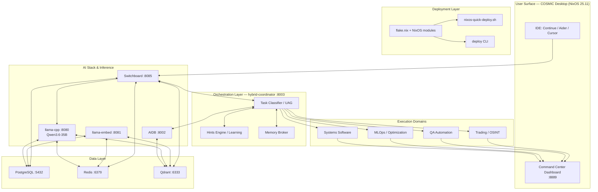

# NixOS Dev Quick Deploy


A production-grade NixOS-first deployment harness that transforms a fresh NixOS host into a fully operational local AI platform with declarative provisioning, host-local inference, multi-agent orchestration, continuous learning, and unified operator visibility.

## 🏛️ Executive Summary

NixOS-Dev-Quick-Deploy is more than a deployment script; it is a **Pessimistic Recursive Self-Improvement (PRSI)** environment. It enables a "closed-loop" autonomous system where every change is evidence-gated, every service is instrumented, and the system continuously learns from human-agent interactions.

### 🚀 Key Innovations

- **PRSI Loops:** Pessimistic execution with bounded iterations, hard timeouts, and evidence-gated completion.
- **Measurement-Driven Ops:** "You cannot manage what you cannot measure." Dashboard parity is a hard requirement for all feature completions.
- **Token Efficiency Strategy:** Progressive disclosure of context, semantic caching (Redis + Qdrant), and contextual bandit hint ranking.
- **Hybrid Intent Routing:** A coordinator-first ingress that intelligently routes tasks between local Qwen3.6-35B models and remote reasoning engines based on complexity and cost.


## Table of Contents

- [Overview](#overview)
- [Quick Start](#quick-start)
- [Architecture](#architecture)
- [AI Stack Services](#ai-stack-services)
- [CLI Tools](#cli-tools)
- [Agent Integrations](#agent-integrations)
- [MCP Servers](#mcp-servers)
- [Skills Library](#skills-library)
- [Workflows](#workflows)
- [Configuration](#configuration)
- [Documentation](#documentation)
- [License](#license)

---

## Overview

### What This Is

NixOS-Dev-Quick-Deploy is:

- **A Nix-first deployment harness** for provisioning NixOS systems (workstations, servers, SBCs)
- **A local AI stack framework** providing host-local inference, embeddings, retrieval, and orchestration
- **An operator control plane** with a command center dashboard and programmatic APIs
- **An agent-oriented development platform** supporting multi-agent workflows and continuous learning
- **A single-repository system** that bootstraps from a fresh NixOS host to a fully operational AI platform

### Core Philosophy

| Principle | Description |
|-----------|-------------|
| **Declarative-first** | Nix modules define system state; runtime scripts are fallbacks only |
| **Local-first** | Host-local inference and storage by default; hybrid routing to remote models optional |
| **Zero bolt-on** | All core features auto-enable on deployment — no manual toggles |
| **Reproducible** | All decisions tracked, git history preserved, rollback-safe |
| **Operator-facing** | Health, visibility, and control surfaces built-in |

### Who This Is For

- NixOS users who want one repository to provision and operate an AI-capable machine
- Developers who want local inference, retrieval, and orchestration without manual setup
- Teams experimenting with agentic development patterns on a reproducible host
- Operators who want clearer health, deployment, and verification workflows

---

## Quick Start

### First-time Machine Bootstrap

```bash
git clone https://github.com/MasterofNull/NixOS-Dev-Quick-Deploy.git ~/NixOS-Dev-Quick-Deploy
cd ~/NixOS-Dev-Quick-Deploy
chmod +x nixos-quick-deploy.sh
./nixos-quick-deploy.sh --host "$(hostname)" --profile ai-dev
```

### Day-2 Operations

```bash
./deploy --help          # Show all commands
./deploy health          # Run health checks
./deploy ai-stack        # AI stack management
./deploy test            # Run validation tests
```

### Post-Deploy Verification

```bash
curl http://127.0.0.1:8889/api/health            # Dashboard health
aq-qa 0 --json                                    # Run QA suite
aq-hints "how do I configure NixOS services"      # Get workflow hints
```

---

## 📡 System Pulse

### Current Status: 🟢 OPERATIONAL
- **Last Validated:** 2026-05-25 20:30 UTC
- **Health Gate:** 17/17 Tier 0 Validation Gates passing.
- **AI Stack:** Qwen3.6-35B local inference stable (CUDA/Vulkan).
- **Observability:** 100% service coverage in Command Center.

### 🏆 Recent Achievements (Cycle 61)
- **Hardened L5/L6 Monitoring:** Added deep-check coverage for MCP server-to-server communication.
- **Tier 0 Evolution:** Hardened the validation gate with path-aware CI checks and declarative contract enforcement.
- **Hybrid Retrieval Lane:** Optimized hybrid search performance (30% latency reduction via semantic caching).

### 🗺️ Future Roadmap
- **Autonomous Parameter Tuning:** Integrating `aq-meta-optimize` for automated model quantization selection.
- **Federated Pattern Sync:** Enabling secure sharing of learned interaction patterns across multiple deployment nodes.
- **Edge Model Registry:** Standardizing local model provenance and integrity verification.

---

## 👁️ Visual Tour


| Overview | Host telemetry | AI stack status |
|----------|----------------|-----------------|
|  |  |  |

---

## 🧐 Reviewer Evaluation Guide

If you are reviewing this repository, we recommend evaluating the following key surfaces:

1.  **Declarative Integrity:** Observe how `nix/modules/services/ai-stack.nix` handles complex systemd wiring without manual scripts.
2.  **Validation Rigor:** Run `scripts/governance/tier0-validation-gate.sh --pre-commit` to see the automated quality gates in action.
3.  **Instruction Projection:** Check `.agent/SYSTEMS-SOFTWARE-INSTRUCTIONS.md` to see how domain-specific knowledge is projected to agents.
4.  **Telemetry Surface:** View `dashboard.html` to understand the measurement-driven philosophy of the platform.
5.  **Audit Trail:** Inspect `AGENTS.md` and `ai-stack/agent-memory/MEMORY.md` to see how multi-agent collaboration state is preserved.

---

## Architecture



### System At A Glance

| Area | What You Get |
|------|--------------|
| **Operating model** | Declarative NixOS + systemd runtime |
| **Primary bootstrap** | `nixos-quick-deploy.sh` |
| **Day-2 operations** | `deploy` CLI |
| **Operator surface** | Command Center dashboard on `127.0.0.1:8889` |
| **Local inference** | llama.cpp inference + embeddings (GPU-accelerated) |
| **Data layer** | PostgreSQL, Qdrant, Redis |
| **AI coordination** | AIDB, hybrid coordinator, Ralph Wiggum, switchboard |
| **Secret handling** | SOPS-nix via `/run/secrets/*` |

---

## AI Stack Services

### Inference Layer

| Service | Port | Purpose | Technology |
|---------|------|---------|------------|
| **llama-cpp** | 8080 | OpenAI-compatible inference API | llama.cpp (CUDA/Vulkan/CPU) |
| **Embeddings** | 8001 | Sentence transformer embeddings | Qwen3-Embedding-4B |
| **Switchboard** | 8085 | LLM routing proxy (local/remote hybrid) | FastAPI + profile routing |
| **Open WebUI** | 3000 | Browser chat interface (optional) | Web-based UI |

### Knowledge & Retrieval

| Service | Port | Purpose | Technology |
|---------|------|---------|------------|
| **AIDB** | 8002 | Knowledge base + tool discovery | PostgreSQL + MCP |
| **Hybrid Coordinator** | 8003 | Query routing, context augmentation, learning | Python + Qdrant |
| **Ralph Wiggum** | 8004 | Autonomous loop orchestrator | Task queuing + checkpoints |
| **Qdrant** | 6333 | Vector search | Qdrant HTTP API |

### Data & Monitoring

| Service | Port | Purpose |
|---------|------|---------|
| **PostgreSQL** | 5432 | Relational DB (AIDB, memory, learning) |
| **Redis** | 6379 | Cache + session store |
| **Prometheus** | 9090 | Metrics collection |
| **Command Center** | 8889 | Operator dashboard + APIs |

### Hardware-Aware Scaling

Services automatically adapt to detected hardware tier:

| Tier | RAM | Concurrency | Model Quantization |
|------|-----|-------------|-------------------|
| nano | <2G | 1 | Q2_K (4-bit) |
| micro | 2-7G | 2 | Q4_K_M |
| small | 8-15G | 4 | Q4_K_M |
| medium | 16-31G | 8 | Q8_0 |
| large | ≥32G | 16 | fp16 |

---

## 🏗️ Functional Domains

The harness is divided into discrete specialized domains, each with its own instruction projection and automation tools:

| Domain | Focus Area | Status |
|--------|------------|--------|
| **Systems Software** | NixOS modules, kernel tuning, hardware acceleration | 🟢 Production |
| **MLOps** | Model quantizing, parameter tuning, performance profiling | 🟡 Active Dev |
| **QA Automation** | Regression gates, chaos smoke tests, parity checks | 🟢 Production |
| **Security Systems** | Vulnerability scanning, AppArmor, network isolation | 🟢 Production |
| **Trading Agents** | Financial data pipelines, risk management synthesis | 🔵 Activated |
| **OSINT Systems** | Open-source intelligence, link analysis, data ingestion | 🔵 Activated |

---

## CLI Tools

### Primary Orchestration: `aqd`

The main workflow CLI for agent orchestration, skill management, and QA.

```bash
# Workflow orchestration
aqd workflows list                              # List available workflows
aqd workflows project-init --target <dir>       # Scaffold new project
aqd workflows brownfield --target <repo>        # Improve existing project
aqd workflows primer --target <repo>            # Read-only session context

# Skill management
aqd skill validate                              # Validate skill format
aqd skill init <name>                           # Create new skill
aqd skill package <path>                        # Package for distribution

# MCP server management
aqd mcp scaffold <name> [--type python|deno]    # Create MCP server
aqd mcp validate <name>                         # Validate server
aqd mcp test <name>                             # Run server tests

# Quality assurance
aqd parity advanced-suite                       # Full QA suite
aqd parity regression-gate --online             # Regression testing
aqd parity chaos-smoke                          # Chaos injection
```

### Core AI Tools (`aq-*`)

| Tool | Purpose |
|------|---------|
| `aq-hints` | Query ranked workflow hints for a task |
| `aq-qa` | Run QA validation suites |
| `aq-report` | Generate system health reports |
| `aq-context-bootstrap` | Classify task and suggest entry points |
| `aq-context-card` | Generate progressive disclosure context |
| `aq-capability-gap` | Detect missing CLI tools or MCP servers |
| `aq-capability-plan` | Generate implementation plan for gaps |
| `aq-capability-remediate` | Auto-apply fixes for gaps |
| `aq-gap-import` | Import external docs into AIDB |
| `aq-llama-debug` | Troubleshoot inference issues |
| `aq-rag-prewarm` | Pre-compute embeddings |
| `aq-autoresearch` | Self-directed autonomous research |
| `aq-patterns` | Extract reusable patterns |
| `aq-collaborate` | Multi-agent task delegation |
| `aq-meta-optimize` | Autonomous parameter tuning |

### System PATH vs Repo-Local

**System PATH installed** (7 tools):
```bash
ls /run/current-system/sw/bin/aq-*
# aq-hints, aq-qa, aq-report, aqd, harness-rpc, project-init, workflow-primer
```

**Repo-local scripts** (44+ tools):
```bash
ls /opt/nixos-quick-deploy/scripts/ai/aq-*
```

---

## Agent Integrations

### Supported Agents

| Agent/IDE | Integration | Features |
|-----------|-------------|----------|
| **Continue.dev** | MCP stdio bridge | Hints provider, tool catalog, local inference |
| **Aider** | MCP wrapper | Git-aware editing, PR generation |
| **Claude (API)** | Remote delegation | Long-form synthesis, architecture decisions |
| **Codex/OpenAI** | Switchboard routing | Profile-based context pruning |
| **Qwen** | Local/remote | Fast implementation tasks |
| **Gemini** | Remote routing | Research & discovery |
| **Ollama** | OpenAI-compatible | Additional local models |

### Multi-Agent Workflow

The system supports orchestrator/sub-agent patterns:

1. **Orchestrator** (Claude Opus, Codex):
   - Plan: decompose into discrete slices
   - Delegate: route architecture → claude, implementation → qwen
   - Review: validate evidence before acceptance

2. **Sub-agents** (Qwen, Gemini):
   - Execute only assigned slice
   - Return evidence: files changed, commands run, tests passed
   - Never re-scope or finalize acceptance

### Agent Profiles

| Profile | Use Case | Agent |
|---------|----------|-------|
| `nixos-systems-architect` | NixOS modules, flakes, hardware | claude (sub) |
| `senior-ai-stack-dev` | AI stack, model selection, observability | claude (sub) |
| `general-coding` | Patches, test scaffolding, runtime logic | qwen |
| `research-synthesis` | Discovery, analysis, documentation | gemini |

---

## MCP Servers

### Core MCP Servers

| Server | Port | Purpose |
|--------|------|---------|
| **hybrid-coordinator** | 8003 | Context augmentation, continuous learning, query routing |
| **aidb** | 8002 | Knowledge base, tool discovery, document lifecycle |
| **llama-embed** | 8081 | Sentence transformer API |
| **ralph-wiggum** | 8004 | Autonomous loop orchestration |
| **aider-wrapper** | 8090 | IDE integration for git-aware editing |
| **health-monitor** | — | Service health tracking |
| **nixos** | — | NixOS option search, module queries |

### MCP Bridge

`mcp-bridge-hybrid.py` translates MCP stdio protocol to hybrid-coordinator REST API.

**Exposed tools:**
- `hybrid_search` — semantic search with optional LLM synthesis
- `get_hints` — workflow hints for current task
- `workflow_plan` — phased plan generation
- `workflow_run_start` — guarded workflow execution
- `store_memory` / `recall_memory` — agent memory operations
- `query_aidb` — knowledge base search

---

## Skills Library

25+ unified skills in `.agent/skills/`:

### AI/Development
- `ai-stack-qa` — QA & validation workflows
- `ai-model-management` — Model lifecycle
- `nixos-deployment` — Deployment automation
- `mcp-builder` — Create MCP servers
- `skill-creator` — Create new skills
- `security-scanner` — Vulnerability scanning
- `performance-profiler` — System profiling
- `debug-workflow` — Interactive debugging

### Data & Knowledge
- `aidb-knowledge` — Query AIDB knowledge base
- `rag-techniques` — RAG implementation patterns
- `xlsx` — Spreadsheet operations
- `pdf` — PDF manipulation
- `pptx` — PowerPoint operations

### Design & UI
- `frontend-design` — Web UI design
- `canvas-design` — Visual art (PNG, PDF)
- `web-artifacts-builder` — React/Tailwind artifacts
- `theme-factory` — Theme generation

### Operations
- `health-monitoring` — System health tracking
- `project-import` — Import external projects
- `system_bootstrap` — System initialization

---

## Workflows

### PRSI Protocol

Plan → Validate → Execute → Measure → Feedback → Compress

```bash
# Generate workflow plan
curl -X POST http://127.0.0.1:8003/workflow/plan \
  -H "Content-Type: application/json" \
  -d '{"q": "implement new feature"}'

# Execute with guardrails
curl -X POST http://127.0.0.1:8003/workflow/run/start \
  -H "Content-Type: application/json" \
  -d '{"plan_id": "...", "dry_run": false}'
```

### Coordinator-First Prompt Routing

Continue/editor prompt ingress now targets the hybrid coordinator first. The
coordinator classifies prompt intent, selects the execution lane, and then uses
switchboard as the downstream execution proxy for local/remote model traffic.

Execution lanes:

| Profile | Behavior |
|---------|----------|
| `default` | Coordinator-selected local-first chat lane |
| `continue-local` | Short prompts, local llama.cpp |
| `remote-free` | Lightweight planning, retrieval, bounded synthesis |
| `remote-reasoning` | Architecture/policy decisions |
| `remote-coding` | Implementation via coding models |
| `remote-tool-calling` | Tool-calling oriented remote execution |
| `embedding-local` | Retrieval-only (no reasoning) |

OpenAI-compatible coordinator ingress:

- `GET /v1/models`
- `POST /v1/chat/completions`
- `POST /v1/completions`

### Continuous Learning

The hybrid-coordinator implements autonomous learning:

1. **Interaction tracking** — Every query + response recorded
2. **Pattern extraction** — Identifies reusable snippets and patterns
3. **Quality cache** — Caches high-value interactions (30-50% token savings)
4. **Federated sync** — Shares patterns across agents

### Autonomous Improvement

Local LLM-driven system optimization (enabled via timer):

1. Analyzes system metrics (GPU util, memory, latency)
2. Generates optimization hypotheses
3. Executes experiments
4. Validates improvements
5. Records decisions

---

## ⚙️ Declarative Configuration

The system is entirely tuned via a unified Nix schema. No manual config file editing is required after bootstrap.

### Core System Profile

```nix
mySystem = {
  hostName = "nixos";
  primaryUser = "user";
  profile = "ai-dev";           # ai-dev, gaming, minimal

  hardware = {
    gpuVendor = "nvidia";       # amd, nvidia, intel, intel-arc, none
    cpuVendor = "amd";          # amd, intel, arm, qualcomm, apple
    systemRamGb = 32;
  };
};
```

### AI Stack Tuning

```nix
mySystem.aiStack = {
  enable = true;
  acceleration = "vulkan";       # auto, vulkan, cuda, rocm, cpu

  llamaCpp = {
    port = 8080;
    activeModel = "qwen3.6-35b"; # High-performance 35B model
  };

  # Declarative MCP wiring
  mcpServers = {
    aidbPort = 8002;
    hybridPort = 8003;
    ralphPort = 8004;
  };
};
```

---

## Repository Structure

```
repo/
├── flake.nix                      # Nix flake entry point
├── nixos-quick-deploy.sh          # Bootstrap script
├── deploy                         # Day-2 operations CLI
├── CLAUDE.md                      # Always-read agent guidance
├── AGENTS.md                      # Agent onboarding (compact)
│
├── nix/
│   ├── modules/
│   │   ├── core/                  # Base options, secrets, networking
│   │   ├── services/              # AI stack services
│   │   ├── roles/                 # System profiles (ai-stack, desktop, server)
│   │   └── hardware/              # GPU/CPU/storage tuning
│   ├── hosts/                     # Host-specific configurations
│   └── home/                      # Home Manager configurations
│
├── scripts/
│   ├── ai/                        # Core harness CLI (aqd, aq-*, mcp-bridge)
│   ├── governance/                # Repo structure, validation
│   ├── health/                    # Health checks
│   └── testing/                   # Test runners
│
├── config/
│   ├── service-endpoints.sh       # Port definitions
│   └── *.yaml                     # Service configurations
│
├── ai-stack/
│   ├── mcp-servers/               # MCP server implementations
│   ├── agents/                    # Agent skill definitions
│   ├── autonomous-improvement/    # Self-optimization
│   └── continue/                  # Continue.dev integration
│
├── .agent/
│   ├── skills/                    # 25+ unified skills
│   ├── commands/                  # Slash-command implementations
│   └── workflows/                 # Workflow state
│
├── dashboard/                     # Command center (React + FastAPI)
│
└── docs/                          # Comprehensive documentation
    ├── agent-guides/              # Progressive disclosure guides
    ├── architecture/              # System design
    └── operations/                # Day-2 operations
```

---

## Documentation

### Getting Started
- [Quick Start](./docs/QUICK_START.md)
- [System Overview](./docs/agent-guides/00-SYSTEM-OVERVIEW.md)
- [Available Tools](./docs/AVAILABLE_TOOLS.md)

### Architecture
- [AI Stack Architecture](./docs/architecture/AI-STACK-ARCHITECTURE.md)
- [Configuration Reference](./docs/CONFIGURATION-REFERENCE.md)
- [Skills and MCP Inventory](./docs/SKILLS-AND-MCP-INVENTORY.md)

### Operations
- [Operator Runbook](./docs/operations/OPERATOR-RUNBOOK.md)
- [Troubleshooting Runbooks](./docs/operations/troubleshooting-runbooks.md)
- [CLI Tool Inventory](./docs/operations/AI-AGENT-SURFACE-MATRIX.md)

### Agent Guides
- [Agent Quick Start](./docs/agent-guides/01-QUICK-START.md)
- [Progressive Disclosure Guide](./docs/agent-guides/45-PROGRESSIVE-DISCLOSURE.md)
- [Hybrid Workflow Model](./docs/agent-guides/40-HYBRID-WORKFLOW.md)
- [Continuous Learning](./docs/agent-guides/22-CONTINUOUS-LEARNING.md)

---

## Validation

### Pre-Commit

```bash
scripts/governance/tier0-validation-gate.sh --pre-commit
```

### Pre-Deploy

```bash
scripts/governance/tier0-validation-gate.sh --pre-deploy
```

### Health Checks

```bash
./deploy health
aq-qa 0 --json
```

---

## 📜 License

[MIT](./LICENSE)
