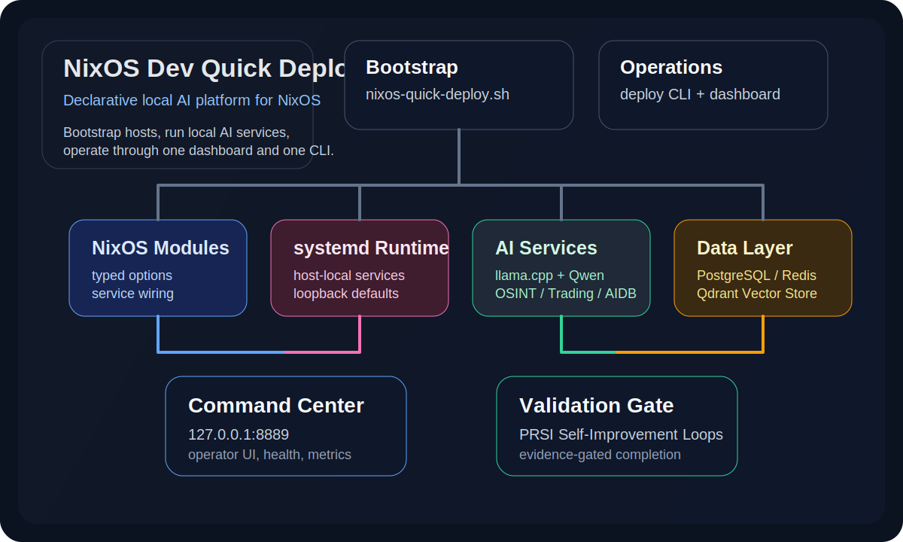
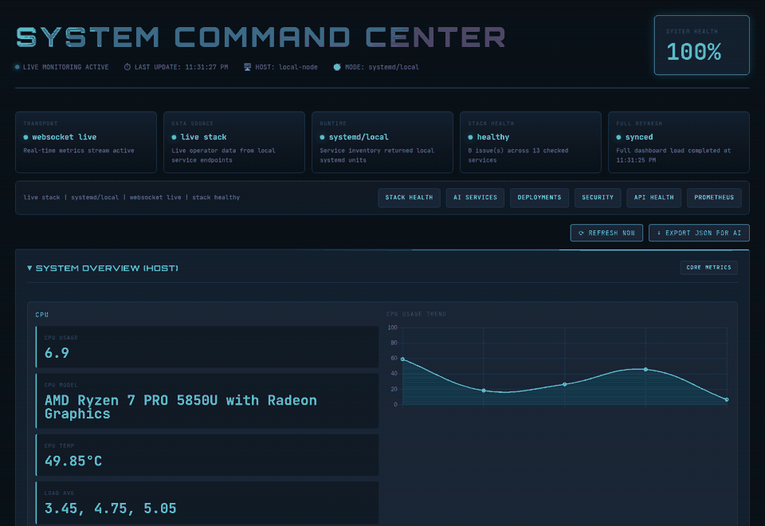
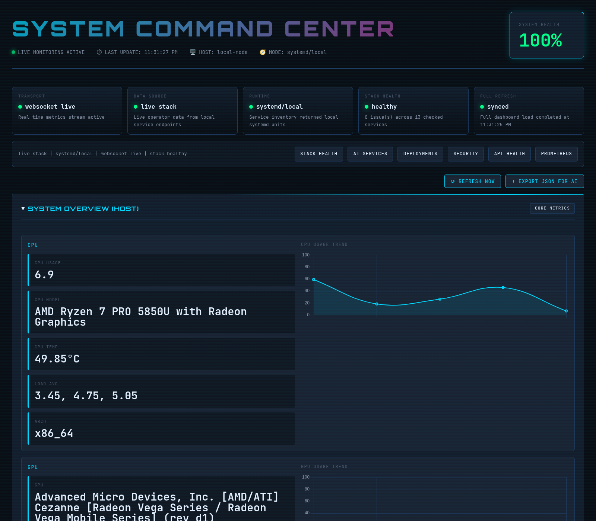
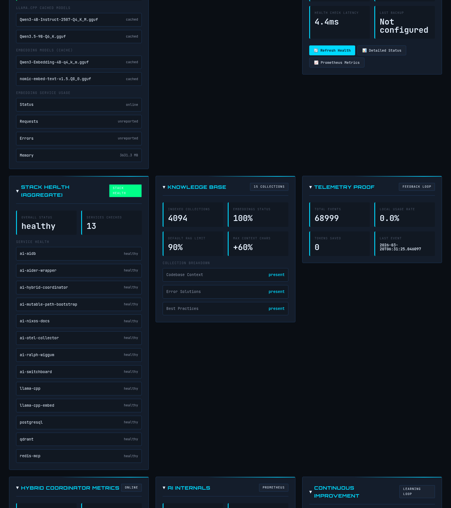
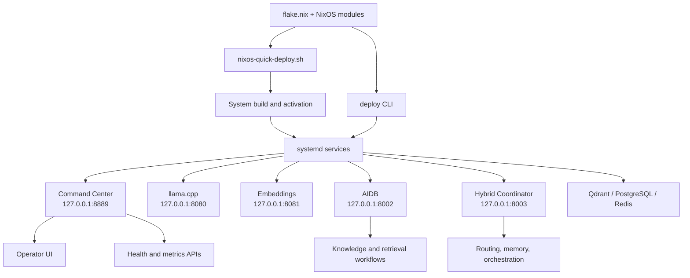
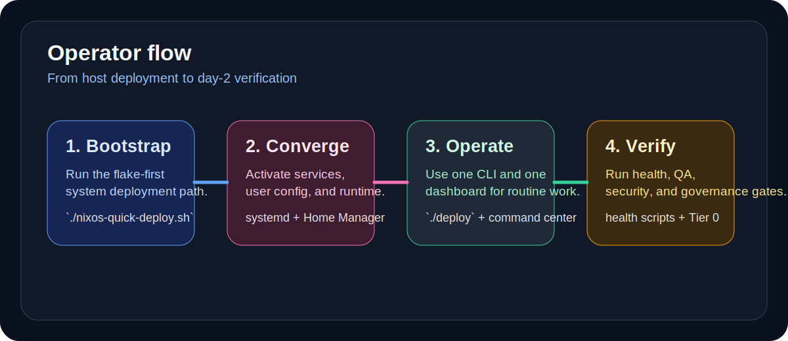
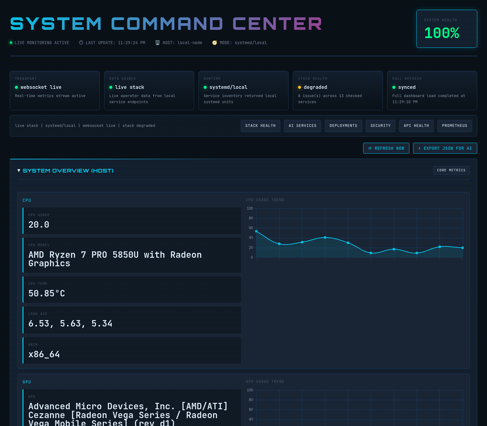

# NixOS Dev Quick Deploy


Build a NixOS workstation or server into a production-shaped local AI platform with declarative deployment, host-local model services, a unified operator dashboard, and a curated operations toolchain.

This repository is the top-level entry point for the system. It is designed to explain the platform quickly, show the main operating model, and then link you into the deeper implementation docs only where needed.



| Jump to | Link |
| --- | --- |
| Quick start | [Deployment Paths](#deployment-paths) |
| System model | [Architecture](#architecture) |
| Docs | [Documentation Map](#documentation-map) |
| Operations | [Operator Experience](#operator-experience) |

## Why This Exists

Most AI dev environments degrade into a pile of one-off scripts, drifting ports, hidden secrets, and unclear runtime ownership. This project takes the opposite approach:

- NixOS-first system provisioning
- declarative service wiring
- host-local AI runtime by default
- operator-facing health and deployment surfaces
- structured documentation for day-1 setup and day-2 operations

The result is a reproducible development system that can bootstrap a machine, run a local AI stack, expose a command center for operators, and provide a foundation for more advanced agentic workflows.

## Who This Is For

- NixOS users who want one repository to provision and operate an AI-capable machine
- developers who want local inference, retrieval, and orchestration infrastructure without stitching it together by hand
- operators who want clearer health, deployment, and verification workflows
- teams experimenting with agentic development patterns on top of a reproducible host

## What It Feels Like

```text
Fresh NixOS host
  -> one repo
  -> one bootstrap path
  -> one operator dashboard
  -> one day-2 operations CLI
  -> one doc tree for deeper implementation detail
```

## Visual Tour



| Overview | Host telemetry | AI stack status |
| --- | --- | --- |
|  |  |  |

## System At A Glance

| Area | What you get |
| --- | --- |
| Operating model | Declarative NixOS + `systemd` runtime |
| Primary bootstrap path | [`nixos-quick-deploy.sh`](./nixos-quick-deploy.sh) |
| Day-2 operations CLI | [`deploy`](./deploy) |
| Operator surface | Command Center dashboard + API on `127.0.0.1:8889` |
| Local inference | `llama.cpp` inference + embeddings services |
| Data layer | PostgreSQL, TimescaleDB, Qdrant, Redis |
| AI coordination | AIDB, hybrid coordinator, Ralph Wiggum, switchboard-oriented tooling |
| Configuration model | Typed Nix options + environment injection |
| Secret handling | Runtime secret providers such as `/run/secrets/*` |

## Architecture





## Core Capabilities

| Capability | Outcome |
| --- | --- |
| Declarative deployment | Repeatable host setup, rebuilds, and updates |
| Local AI runtime | Private, host-local inference and embeddings |
| Retrieval stack | Search, memory, and vector-backed workflows |
| Operator control plane | Browser-accessible health, visibility, and dashboard APIs |
| Agent workflow support | Project scaffolding, plans, hints, and structured automation |

### 1. Full-system NixOS deployment

- Bootstrap a fresh or partially configured NixOS machine.
- Apply system and Home Manager configuration from the same repo.
- Run preflight checks, dry builds, health checks, and post-deploy convergence steps.

### 2. Local AI stack runtime

- OpenAI-compatible local inference via `llama.cpp`
- dedicated embeddings service
- host-local database and vector storage
- hybrid coordination and memory endpoints
- operator health visibility through the command center

### 3. Unified operations surface

- `deploy` provides a consolidated CLI for system, AI stack, health, testing, security, dashboard, config, search, and recovery flows.
- The command center provides a browser-based operator interface with health and deployment visibility.

### 4. Agent-oriented project scaffolding

- Workflow bootstrapping via `scripts/ai/aqd`
- progressive-disclosure agent context patterns
- roadmap and plan artifacts under `.agents/`
- support for sub-agent and reviewer-gate style workflows

## Main Implementations

| Component | Implementation |
| --- | --- |
| System configuration | [`flake.nix`](./flake.nix), [`nix/`](./nix), [`config/`](./config) |
| Deployment entrypoint | [`nixos-quick-deploy.sh`](./nixos-quick-deploy.sh) |
| Unified operations CLI | [`deploy`](./deploy), [`lib/deploy/`](./lib/deploy) |
| Dashboard and operator API | [`dashboard/`](./dashboard) |
| AI services and MCP servers | [`ai-stack/`](./ai-stack), [`mcp-servers/`](./mcp-servers) |
| Health, QA, and governance automation | [`scripts/`](./scripts), [`tests/`](./tests) |
| Reference docs and runbooks | [`docs/`](./docs) |

## Deployment Paths

Choose the path that matches your stage:

| If you need to... | Use |
| --- | --- |
| Provision or update the host itself | [`nixos-quick-deploy.sh`](./nixos-quick-deploy.sh) |
| Run routine management tasks after deployment | [`deploy`](./deploy) |
| Check runtime health and operator APIs | Command Center + health scripts |

### First-time machine bootstrap

Use the flake-first deployment script when you are provisioning or updating the host itself.

```bash
git clone https://github.com/MasterofNull/NixOS-Dev-Quick-Deploy.git ~/NixOS-Dev-Quick-Deploy
cd ~/NixOS-Dev-Quick-Deploy
chmod +x nixos-quick-deploy.sh
./nixos-quick-deploy.sh --host "$(hostname)" --profile ai-dev
```

Useful variants:

```bash
./nixos-quick-deploy.sh --help
./nixos-quick-deploy.sh --analyze-only
./nixos-quick-deploy.sh --build-only
./nixos-quick-deploy.sh --boot
```

What this does:

- evaluates the flake target for the current host or selected host
- runs deployment preflight and readiness checks
- applies system and Home Manager changes
- converges the local AI stack and operator runtime

### Day-2 operations and system management

Use `deploy` after the system is in place and you want a cleaner operations interface.

```bash
./deploy --help
./deploy health
./deploy ai-stack
./deploy dashboard
./deploy test
./deploy security
```

What this is for:

- recurring health and test runs
- AI stack management and diagnostics
- dashboard operations
- security and recovery workflows

### Post-deploy verification

```bash
curl http://127.0.0.1:8889/api/health
curl http://127.0.0.1:8889/api/health/aggregate | jq .
bash scripts/health/system-health-check.sh --detailed
bash scripts/ai/ai-stack-health.sh
```

## Operator Experience

The command center is the main operator-facing runtime surface:



- Dashboard URL: `http://127.0.0.1:8889/`
- API docs: `http://127.0.0.1:8889/docs`
- health endpoint: `http://127.0.0.1:8889/api/health`
- aggregate health: `http://127.0.0.1:8889/api/health/aggregate`

For dashboard development only:

```bash
cd dashboard
./start-dashboard.sh
```

Typical operator checks:

```bash
systemctl status command-center-dashboard-api.service
curl http://127.0.0.1:8889/api/health
curl http://127.0.0.1:8889/api/health/aggregate | jq '.overall_status'
```

## Security And Reliability Defaults

- Secrets are expected from runtime providers such as `/run/secrets/*`.
- Core services are intended to remain on host-local interfaces unless deliberately reconfigured.
- Ports and URLs should come from Nix options and injected environment, not hardcoded literals.
- Validation gates and health checks are part of the intended workflow, not optional polish.

## Project Positioning

This is not just a shell script collection. It is a NixOS-centered platform repo that combines:

- host provisioning
- AI runtime composition
- operator visibility
- automation and governance gates
- roadmap-driven agent workflow development

The root README stays intentionally high level. It should help someone understand the system, trust the operating model, and find the right deeper document quickly.

## Repository Map

| Path | Purpose |
| --- | --- |
| [`nix/`](./nix) | NixOS modules, roles, and system configuration |
| [`config/`](./config) | Endpoint definitions and deployment config |
| [`dashboard/`](./dashboard) | Command center backend and dashboard development assets |
| [`ai-stack/`](./ai-stack) | AI stack services, agents, and MCP implementations |
| [`scripts/`](./scripts) | Deployment, governance, health, QA, and automation tooling |
| [`tests/`](./tests) | Integration, chaos, and validation coverage |
| [`.agents/`](./.agents) | Plans, designs, and agent workflow artifacts |
| [`docs/`](./docs) | Runbooks, architecture, references, and roadmap material |

## Documentation Map

Start here:

- [Quick Start](./docs/QUICK_START.md)
- [System Overview](./docs/agent-guides/00-SYSTEM-OVERVIEW.md)
- [Operator Runbook](./docs/operations/OPERATOR-RUNBOOK.md)
- [Quick Reference](./docs/operations/reference/QUICK-REFERENCE.md)

Architecture and implementation:

- [AI Stack Architecture](./docs/architecture/AI-STACK-ARCHITECTURE.md)
- [Configuration Reference](./docs/CONFIGURATION-REFERENCE.md)
- [Available Tools](./docs/AVAILABLE_TOOLS.md)
- [Skills and MCP Inventory](./docs/SKILLS-AND-MCP-INVENTORY.md)

Deployment and operations:

- [Clean Setup](./docs/CLEAN-SETUP.md)
- [AQD CLI Usage](./docs/AQD-CLI-USAGE.md)
- [AI Stack Runbook](./docs/operations/procedures/AI-STACK-RUNBOOK.md)
- [Credential Management Procedures](./docs/operations/procedures/CREDENTIAL-MANAGEMENT-PROCEDURES.md)

Roadmaps and active direction:

- [System Excellence Roadmap](./.agents/plans/SYSTEM-EXCELLENCE-ROADMAP-2026-Q2.md)
- [Next-Generation Agentic Roadmap](./.agents/plans/NEXT-GEN-AGENTIC-ROADMAP-2026-03.md)

## Implementation Snapshot

```text
System layer
  flake.nix
  nix/modules/*
  config/*

Runtime layer
  systemd services
  dashboard backend
  AI stack services
  databases and vector store

Operations layer
  nixos-quick-deploy.sh
  deploy
  scripts/health/*
  scripts/governance/*

Knowledge layer
  docs/*
  .agents/plans/*
  agent guides and runbooks
```

## Design Principles

- Declarative first
- local-first runtime
- strong operator visibility
- security without hardcoded secrets
- one documented source of truth per operational concern

## Validation Gate

Before commit:

```bash
scripts/governance/tier0-validation-gate.sh --pre-commit
```

Before deploy:

```bash
scripts/governance/tier0-validation-gate.sh --pre-deploy
```

## License

[MIT](./LICENSE)
