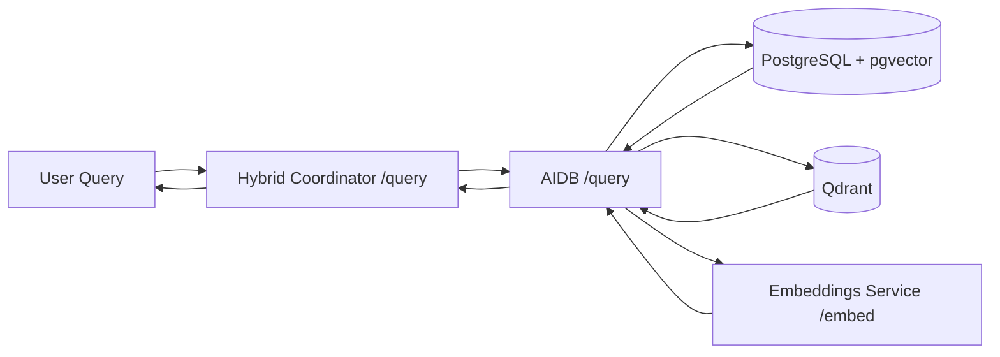
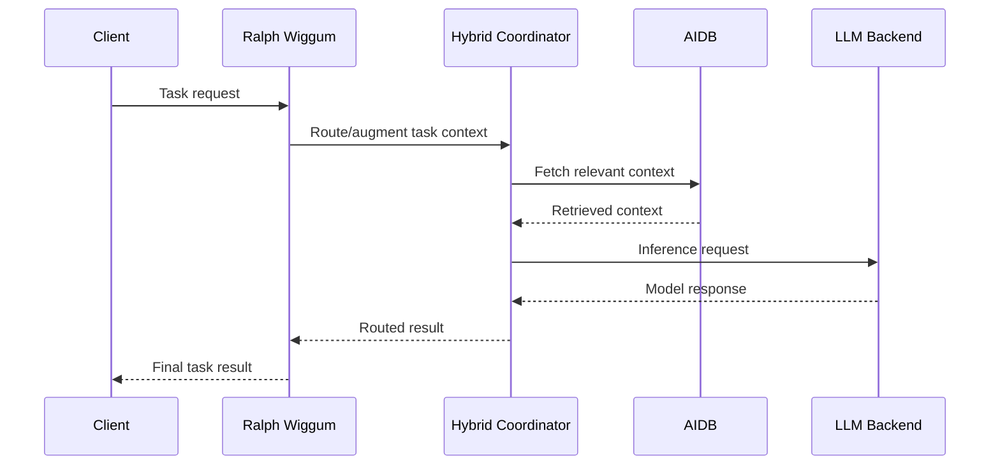
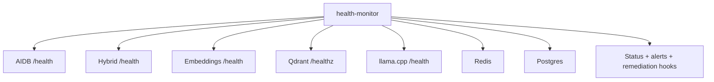

# AI Stack Data Flows

This document captures the current, implemented data flow for the deployed AI stack services.

## 1. RAG Pipeline Flow



## 2. Task Execution Flow



## 3. Health Monitoring Flow



## 4. API Contracts (Primary)

| Service | Endpoint | Method | Contract Source |
|---|---|---|---|
| AIDB | `/health`, `/health/ready`, `/health/detailed` | `GET` | `ai-stack/mcp-servers/aidb/server.py` |
| AIDB | `/query` | `POST` | `ai-stack/mcp-servers/aidb/README.md` + service code |
| Hybrid Coordinator | `/health` | `GET` | `docs/api/hybrid-openapi.yaml`, `ai-stack/mcp-servers/hybrid-coordinator/server.py` |
| Hybrid Coordinator | `/query` | `POST` | `ai-stack/mcp-servers/hybrid-coordinator/server.py` |
| Hybrid Coordinator | `/augment_query` | `POST` | `docs/api/hybrid-openapi.yaml` |
| Embeddings Service | `/health`, `/embed` | `GET`, `POST` | `docs/api/embeddings-openapi.yaml` |
| Ralph Wiggum | `/health` | `GET` | `ai-stack/mcp-servers/ralph-wiggum/server.py` |

## 5. Data Transformation Notes

- Query text is normalized and context-augmented in Hybrid Coordinator before downstream retrieval/inference.
- AIDB retrieves from vector and relational stores, then assembles context for response generation.
- Embeddings service transforms raw text input into vector arrays used by retrieval workflows.

## 6. Validation Procedures

Run these to validate the documented flows:

```bash
# Service health
curl -sf http://localhost:8091/health
curl -sf http://localhost:8092/health
curl -sf http://localhost:8081/health

# Hybrid query path
curl -sf -X POST http://localhost:8092/query \
  -H 'Content-Type: application/json' \
  -d '{"query":"health check","context":"minimal"}'
```

Kubernetes check path:

```bash
kubectl get pods -n ai-stack
kubectl get svc -n ai-stack
```

## 7. Troubleshooting

- `Hybrid /query` fails:
  - verify `ai-stack/mcp-servers/hybrid-coordinator/server.py` routes and service pod logs.
- Retrieval quality drops:
  - verify embeddings service health and embedding dimensions.
- Slow responses:
  - inspect dependency health (`Postgres`, `Qdrant`, `Redis`) and model backend latency.

## 8. Performance Considerations

- Keep embeddings model warm to reduce first-query latency.
- Avoid oversized context windows for frequent low-complexity queries.
- Monitor vector DB latency and memory pressure under concurrent load.
- Prefer local in-cluster service addressing to avoid unnecessary egress hops.
