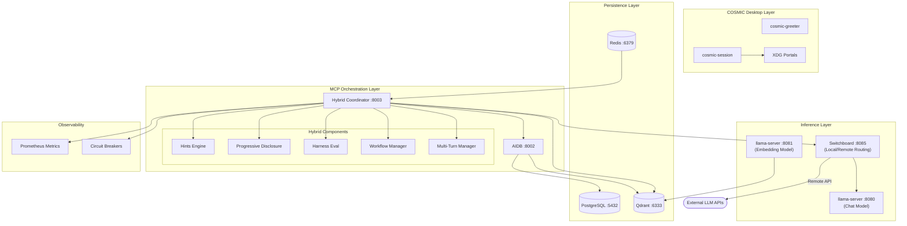
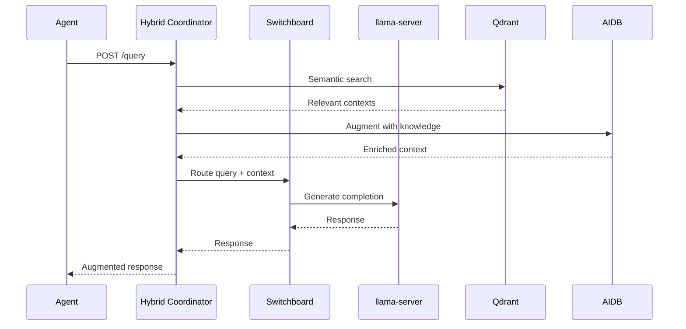
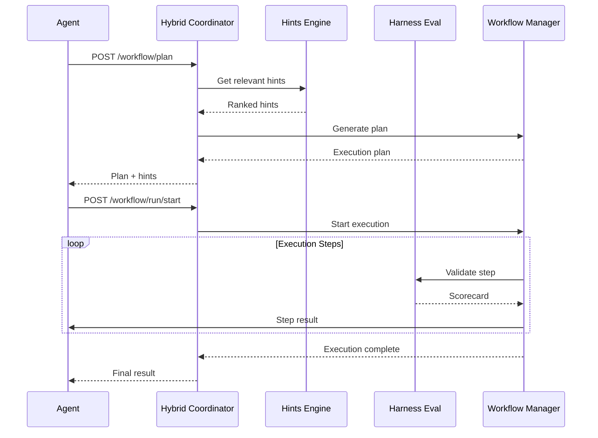
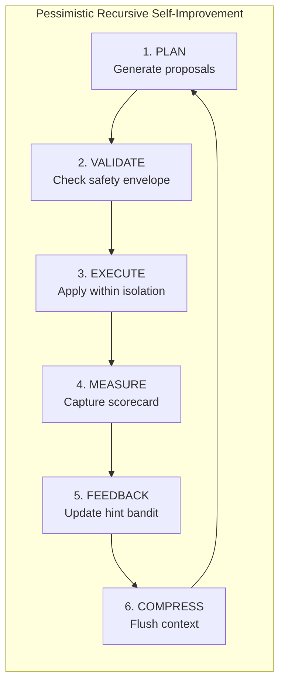
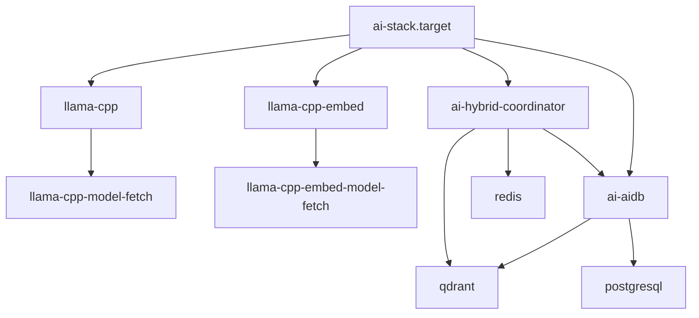
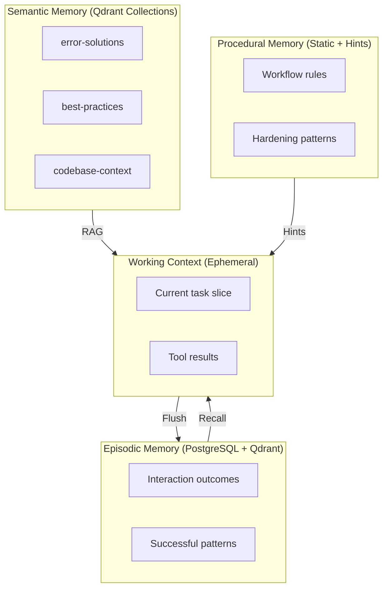
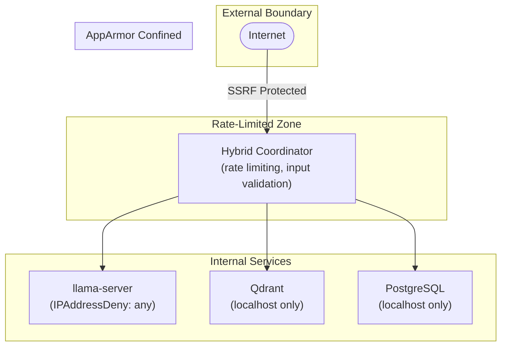

# AI Stack Architecture

Status: Active
Owner: AI Stack Maintainers
Last Updated: 2026-03-05

## Overview

This document describes the architecture of the NixOS-Dev-Quick-Deploy AI Stack, a local-first inference and orchestration system.

## System Architecture Diagram

## Component Descriptions

### Inference Layer

| Component | Port | Purpose |
|-----------|------|---------|
| llama-server (chat) | 8080 | OpenAI-compatible chat completions |
| llama-server (embed) | 8081 | Text embeddings for RAG |
| Switchboard | 8085 | Routes queries to local or remote LLM |

### MCP Orchestration Layer

| Component | Port | Purpose |
|-----------|------|---------|
| Hybrid Coordinator | 8003 | Workflow orchestration, hints, harness eval |
| AIDB | 8002 | Knowledge base, tool discovery, RAG pipeline |

### Persistence Layer

| Component | Port | Purpose |
|-----------|------|---------|
| PostgreSQL | 5432 | Relational data, interaction history |
| Redis | 6379 | Session cache, rate limiting state |
| Qdrant | 6333 | Vector database for semantic search |

## Data Flow Diagrams

### Query Flow

### Workflow Execution Flow

### PRSI Loop

## Service Dependencies

## Memory Architecture

## Security Boundaries

## Port Reference

| Service | Port | Protocol | Exposure |
|---------|------|----------|----------|
| llama-server (chat) | 8080 | HTTP | localhost |
| llama-server (embed) | 8081 | HTTP | localhost |
| Switchboard | 8085 | HTTP | localhost |
| AIDB | 8002 | HTTP | localhost |
| Hybrid Coordinator | 8003 | HTTP | localhost* |
| Qdrant HTTP | 6333 | HTTP | localhost |
| Qdrant gRPC | 6334 | gRPC | localhost |
| PostgreSQL | 5432 | TCP | localhost |
| Redis | 6379 | TCP | localhost |
| Open WebUI | 3000 | HTTP | LAN (optional) |

*LAN exposure controlled by `mySystem.aiStack.listenOnLan`

---

*See also: [docs/api/hybrid-openapi.yaml](../api/hybrid-openapi.yaml) for API specification*
