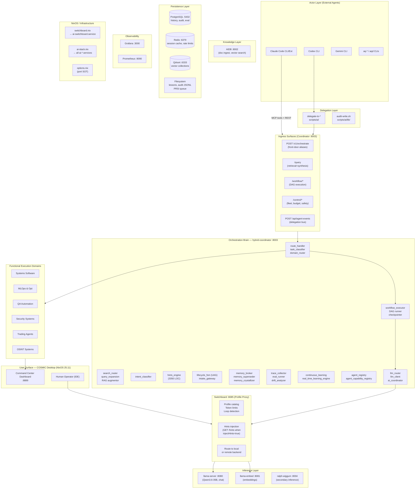
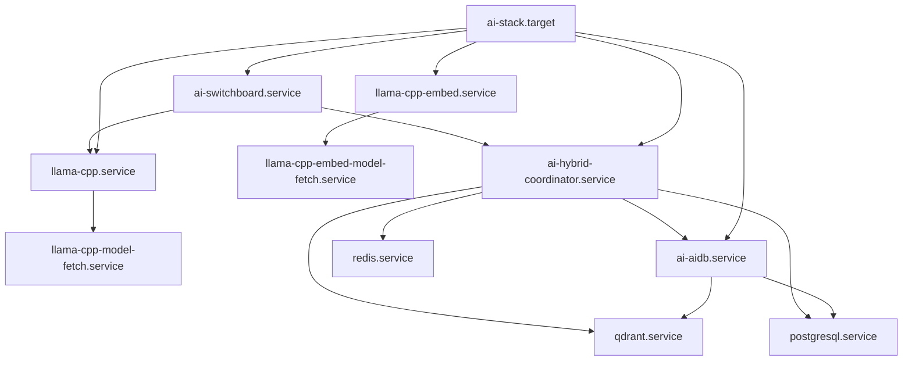
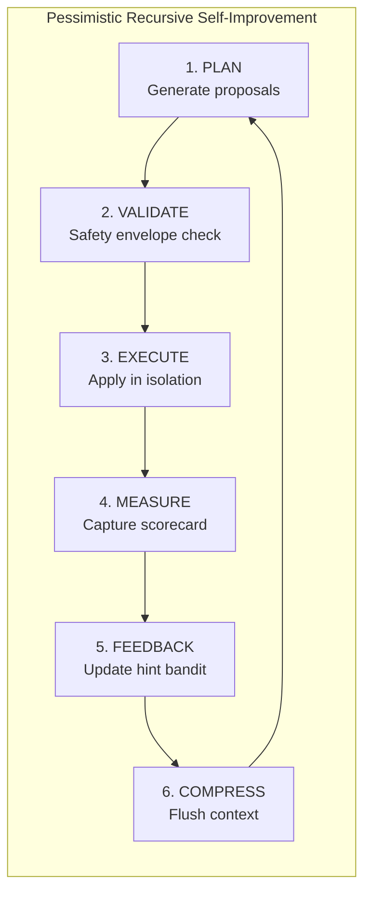

# AI Stack Architecture
Status: Active
Owner: AI Stack Maintainers
Last Updated: 2026-05-15 (Phase 56.9 — full revamp from Phase 56 baseline)
Supersedes: previous version dated 2026-03-05

> For request routing details and flow diagrams: [REQUEST-ROUTING-FLOW.md](REQUEST-ROUTING-FLOW.md)
> For full relational graph (scripts, Nix modules, delegation): [RELATIONAL-GRAPH.md](RELATIONAL-GRAPH.md)
> For coordinator Python module map: [hybrid-coordinator-module-map.md](hybrid-coordinator-module-map.md)

---

## System Overview

NixOS-Dev-Quick-Deploy runs a local-first AI agent stack. All inference runs on-device (Qwen3.6-35B via llama.cpp, 12 GPU layers). Remote LLM access is optional and gated by budget policy.

**What this stack is NOT:**
- Not a typical chatbot frontend — it is a harness for AI agent workflows
- The coordinator does not "bridge" local and remote — the **switchboard** does that
- "Hybrid" in "hybrid-coordinator" means dual-protocol (MCP stdio + HTTP REST), not dual-backend routing

---

## Full System Layer Diagram


    gemini --> delScripts
    delScripts --> auditLib
    auditLib --> agentEvents

    %% Actor → Switchboard (IDE path)
    human --> |"x-ai-profile: continue-local\ndefault, local-agent"| Switchboard
    claude --> |"x-ai-profile: default\n(untagged)"| Switchboard

    %% aq tools → Coordinator
    aq --> Ingress

    %% Coordinator internals
    orchestrate --> routeHandler
    query --> routeHandler
    routeHandler --> intentClass
    intentClass --> searchRouter
    searchRouter --> hintsEngine
    routeHandler --> llmRouter
    workflow --> workflowExec
    agentEvents --> learning

    %% Coordinator → Switchboard (LLM generation backend)
    llmRouter --> |"POST /v1/chat/completions\n(LLM backend)"| Switchboard

    %% Switchboard → Coordinator (hints sidecar — Direction 1)
    hintsInject --> |"GET /hints\n(injectHints=true profiles ONLY)"| hintsEngine

    %% Switchboard → Inference
    swbRoute --> llama
    swbRoute --> |"remote-* profiles"| external([Remote API])

    %% Coordinator → Knowledge
    searchRouter --> aidb
    searchRouter --> qdrant
    llmRouter --> ralph

    %% Knowledge → Persistence
    aidb --> qdrant
    aidb --> postgres

    %% Coordinator → Persistence
    tracing --> postgres
    memBroker --> qdrant
    memBroker --> postgres
    learning --> disk
    routeHandler --> redis

    %% Embed usage
    llamaEmbed --> qdrant
    hintsInject --> |"embed for prune"| llamaEmbed

    %% Dashboard reads
    dashboard --> |"read-only"| Coordinator

    %% NixOS creates services
    switchboardNix --> Switchboard
    aiStackNix --> Coordinator
    aiStackNix --> Inference
    optionsNix --> switchboardNix
    optionsNix --> aiStackNix
```

---

## Component Reference

### Actor Layer (External Agents)

| Actor | Protocol | Primary integration point |
|-------|----------|--------------------------|
| Claude Code CLI | HTTP REST + MCP stdio | Coordinator :8003 endpoints + MCP tools |
| Claude Code Extension | OpenAI-compat HTTP | Switchboard :8085 (`default` profile) |
| Codex CLI | bash → delegate-to-codex | `/api/agent-events` + task delegation |
| Gemini CLI | bash → delegate-to-gemini | `/api/agent-events` + task delegation |
| Human (IDE) | OpenAI-compat HTTP | Switchboard :8085 (profile selected by IDE model entry) |
| aq-* / aqd | HTTP REST | Coordinator :8003 sub-APIs |
| Qwen local agent (aq-agent-loop) | OpenAI-compat HTTP | llama-server :8080 **DIRECT** |

### Switchboard :8085 — Profile Execution Proxy

The switchboard is a FastAPI service defined as a Python script inside `nix/modules/services/switchboard.nix`. It is **not** a router that decides where to send work — it is a **profile executor** that:
1. Reads the `x-ai-profile` header to select a profile from the catalog
2. Applies token budget limits and message count caps
3. Optionally fetches hints from the coordinator (`GET /hints`) and injects them
4. Optionally prepends a profile card system message
5. Forwards the shaped request to local llama or remote API

**It is called by both IDE clients (Path A) and the coordinator (Path B). These are two different traffic flows sharing the same service.**

Profile catalog defined in Nix at `switchboard.nix:202–352`. Profile selection at request time.

### Coordinator :8003 — Orchestration Brain

The coordinator (`ai-stack/mcp-servers/hybrid-coordinator/`) is a 121-module Python service that owns:
- Route policy (routing_contract.py — canonical tier taxonomy)
- Workflow DAG execution (workflow_executor.py)
- UAG lifecycle (lifecycle_fsm.py)
- Hints ranking and serving (hints_engine.py)
- Memory management (memory_broker, superseder, crystallizer)
- Agent event bus (/api/agent-events)
- Continuous learning and lesson registry
- Trace collection and eval scoring
- Fleet control, budget policy, safety gating

**"Hybrid" in the name means: supports MCP stdio protocol AND HTTP REST. It does NOT mean hybrid local/remote routing — that is the switchboard's job.**

### AIDB :8002 — Knowledge Base

Document ingest and vector search service. Primary interface:
- `POST /documents` — ingest with fields: `content, project, relative_path, title`
- `POST /vector/search` — semantic search (returns `distance`, not `score`)
- `GET /documents?limit=5000&project=NAME` — list documents

Auto-reindexed every 24h via `ai-aidb-reindex.timer`. Manual: `sudo systemctl start ai-aidb-reindex`.

### llama-server :8080 — Chat Inference

Qwen3.6-35B GGUF, 12 GPU layers (Vulkan partial offload on AMD Renoir iGPU). OpenAI-compatible API. Inference ~90–120s/response. All callers need 300s+ timeouts. Called by:
- Switchboard (on behalf of IDE clients or coordinator)
- aq-agent-loop (direct, bypasses switchboard)

### ralph-wiggum :8004 — Secondary Inference

Secondary inference endpoint. TaskRequest field is `prompt` (not `task`). Called by coordinator's llm_router for specialized tasks. Not exposed to direct user traffic.

---

## Service Dependencies (systemd order)



---

## Security Model

```
External boundary:    rate limiting, input validation in coordinator
Internal services:    llama-server (IPAddressDeny=any except localhost)
                      Qdrant, PostgreSQL (localhost only)
AppArmor confinement: llama-server process
Auth:                 coordinator requires hybrid_coordinator_api_key header
                      AIDB requires X-API-Key header
                      Switchboard: no auth (localhost only)
Loopback bypass:      coordinator auth_middleware has explicit loopback exemption
                      for agent-prefixed callers; see http_server.py ~line 1412
```

---

## Port Reference

| Service | Port | Protocol | Auth |
|---------|------|----------|------|
| llama-server (chat) | 8080 | HTTP | none |
| llama-server (embed) | 8081 | HTTP | none |
| AIDB | 8002 | HTTP | X-API-Key |
| hybrid-coordinator | 8003 | HTTP | hybrid_coordinator_api_key |
| ralph-wiggum | 8004 | HTTP | aidb_api_key (shared) |
| switchboard | 8085 | HTTP | none (localhost only) |
| dashboard | 8889 | HTTP | none |
| Grafana | 3000 | HTTP | none |
| Open WebUI | 3001 | HTTP | none |

All port values are defined in `nix/modules/core/options.nix` — the single source of truth. Never hardcode these values in Python or shell.

---

## PRSI Loop (Self-Improvement)



Queue: `/var/lib/nixos-ai-stack/prsi/action-queue.json`
Orchestrator: `scripts/automation/prsi-orchestrator.py [sync|list|verify|approve|execute]`

---

## Known Architecture Issues (Active Backlog)

| Issue | Location | Severity | Status |
|-------|----------|----------|--------|
| ~~Orphaned routing taxonomy in router.py~~ | `ai-stack/local-orchestrator/router.py` | Medium | **RESOLVED** — C-5 (arch-revamp): thin adapter emits `RoutingDecision`/`RoutingTier` from routing_contract.py; `AgentBackend` shim preserved |
| ~~Orphaned routing taxonomy in task_router.py~~ | `ai-stack/local-agents/task_router.py` | Medium | **RESOLVED** — C-6 (arch-revamp): DEPRECATED comment added; callers migrated to canonical import; file kept for compat |
| ~~Duplicate: garbage_collection.py vs garbage_collector.py~~ | coordinator | Low | **RESOLVED** — G-1: archive copy deleted; `extensions/garbage_collector.py` wired into `server.py` (1h GC scheduler) |
| ~~Duplicate: continuous_learning.py vs real_time_learning_engine.py~~ | coordinator | Medium | **RESOLVED** — G-2: `continuous_learning.py` marked DEPRECATED; `real_time_learning_engine.py` is canonical |
| 121 Python files in flat directory (no subdir structure) | coordinator | Medium | Deferred — Phase B.2 split plan (Q-4) |
| Tests mixed with production code | coordinator | Low | Deferred — move to tests/ subdirectory |
| ~~System map was 2.5 months stale~~ | docs/architecture/ | — | **RESOLVED** — arch-revamp rewrite |
| ~~Circular hints loop (P0)~~ | switchboard ↔ coordinator | Critical | **RESOLVED** — N-1 + C-1: coordinator-internal profile + header injection |
| ~~continue-local blank screen~~ | switchboard N-2 | High | **RESOLVED** — streaming forced for all local profiles |
| ~~Hint injection at wrong position~~ | switchboard N-4 | Medium | **RESOLVED** — now injects at FIRST system message |
| ~~Auth probe treats 401/403/404 as healthy~~ | agent_executor.py C-2 | High | **RESOLVED** — status_code < 400 threshold |

See `.agents/archive/20260531-plans/ARCH-REVAMP-PRD.md` for full revamp history (archived 2026-05-31).
