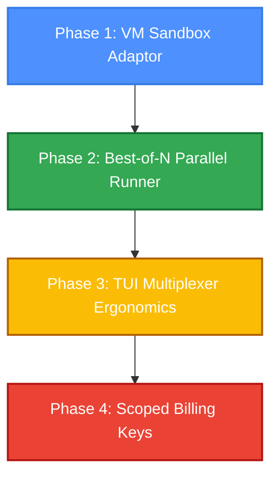

# Parity Analysis & Roadmap: "Factory-in-a-Box" Sandbox Orchestration

This document presents a comprehensive visual and structural analysis of IndyDevDan's sandbox-native developer environment and defines a roadmap to integrate these patterns into the NixOS-Dev-Quick-Deploy harness.

---

## 1. Video Analysis: Scribe & Visual Walkthrough

### Philosophy: Scale, Isolation, and Autonomy
The core premise is that **human developers are the bottleneck**. Traditional agent loops run locally on the developer's computer, sharing the local file system and credentials. To scale agent workflows, they must run in **ephemeral, isolated virtual environments** where they can execute autonomously, allowing the developer to "step away from the loop" and only participate in the planning and validation phases.

```
+--------------------------------------------------------------+
|                     OUTBOX ORCHESTRATOR                      |
|                 (Host / Global Controller)                   |
+------------------------------+-------------------------------+
                               |
            Spawns & Coordinates Fleet (SSH/API)
                               |
  +----------------------------+----------------------------+
  | (Sandbox 1: Default)       | (Sandbox 2: Deepest Seek)  |
  |  +----------------------+  |  +----------------------+  |
  |  |  INBOX ORCHESTRATOR  |  |  |  INBOX ORCHESTRATOR  |  |
  |  +----------+-----------+  |  +----------+-----------+  |
  |             |              |             |              |
  |      Executes SDLC         |      Executes SDLC         |
  |             v              |             v              |
  |  +----------+-----------+  |  +----------+-----------+  |
  |  |   SOFTWARE FACTORY   |  |  |   SOFTWARE FACTORY   |  |
  |  | (Planner/Builder/QA) |  |  | (Planner/Builder/QA) |  |
  |  +----------------------+  |  +----------------------+  |
  +----------------------------+----------------------------+
```

### Video Scribe & Visual Timeline
*   **0:00 - 4:15 | The Multi-Tier Architecture:** IndyDevDan outlines the architectural division:
    *   **Outbox Orchestrator:** Runs on the host machine. Spawns sandboxes, injects configuration, coordinates "Best-of-N" runs, and collects results.
    *   **Inbox Orchestrator:** Runs inside the virtual machine. Handles local tasks, coordinates code generation, builds, and validation.
    *   **Software Factory / ADW (Agent Developer Workflows):** Dedicated agents (Scouter, Planner, Builder, Tester) that carry out code modifications within the sandbox.
*   **4:15 - 14:30 | The Redesign Task & Best-of-N Fleet:**
    *   **Task:** Redesign the user interface of a writing application ("Inkwell") to convert it into a dark-themed, minimal "quiet room" editor with custom typography and smooth panel transitions.
    *   **Best-of-N Configurations:** Launches five concurrent sandboxes, each with a different model stack/profile:
        1.  *Default:* Standard baseline team.
        2.  *Frontier:* State-of-the-art frontier models (e.g., Claude 3.5 Opus/Sonnet).
        3.  *Deepest Seek:* Economical, code-heavy (DeepSeek-based).
        4.  *Open Weights:* Pure open-weights (Llama-based).
        5.  *Top Speed:* High-speed, low-cost models (Gemini Flash / Llama 3 8B).
*   **14:30 - 21:45 | Terminal Multiplexer & Cloud Code Controls:**
    *   **Visual Interface (Herder):** Shows a terminal split into a grid of 5 panes. The Outbox Orchestrator uses `Herder` to SSH into all 5 sandbox VMs simultaneously.
    *   **Execution:** We see parallel compilation logs, node installations, and server starts.
    *   **Cloud Code Interaction:** Shows interactive VS Code Server panels for each sandbox. The developer can bypass authorization warnings and interact directly with the agent workspace or preview the live web app through exposed ports.
*   **21:45 - 28:00 | Sandbox Provisioning & Cost Bounding:**
    *   **Sandbox Provider (`exe.dev`):** Utilizes on-demand Linux virtual machines that boot in under 5 seconds. They are permanent or throwaway, secure, and support public port mapping (port 3000 for the app, and private ports for the agent gateway).
    *   **Billing Security:** Shows OpenRouter dynamic sub-keys. The Outbox Orchestrator provisions an API key capped at $50. When the run finishes and the sandbox is destroyed, the key is revoked.
*   **28:00 - 37:10 | Evaluation & Synthesis:**
    *   **Results:** The "Top Speed" (Gemini Flash) and "Open Weights" versions finished fast and look great. The "Frontier" version (Opus 5) got stuck in a loop and wasted tokens.
    *   **Comparison:** Teases apart the difference in layout details and tokconomics. The developer reviews the visual outputs of all versions and merges the best execution.

---

## 2. Comparison Against AQ-OS Architecture

| Feature | IndyDevDan "Factory-in-a-Box" | AQ-OS Current Implementation | Gaps & Trajectory |
|---|---|---|---|
| **Sandbox Isolation** | Virtual Machine-level (`exe.dev`) | Directory/Git-worktree level ([workspace_isolation.py](../../ai-stack/orchestration/workspace_isolation.py)) | **Gap:** Lacks VM-level orchestration. Sandboxes run locally via `nsjail`/systemd namespaces. |
| **Orchestration Flow** | Outbox -> Inbox -> Factory | Hybrid-coordinator (`http_server.py`) -> UAG | **Partial Parity:** We have graph execution but lacks a distinct Outbox/Inbox process boundary. |
| **Best-of-N Execution** | Parallel VM generation + manual review | Forkable sessions (`/workflow/session/fork`) | **Gap:** We have the branching APIs but no automated concurrent evaluation runner. |
| **Multiplexer TUI** | Grid-based SSH using `Herder` | Blueprint for `aq-herdr` layout design | **Partial Parity:** Infrastructure is planned ([herdr.nix](../../nix/home/herdr.nix)), CLI needs execution. |
| **Cost & Key Control** | Ephemeral, budget-capped OpenRouter keys | Policy-based token budgeting (`config/runtime-budget-policy.json`) | **Gap:** We do not dynamically provision or revoke API sub-keys per sandbox run. |

---

## 3. Gap Analysis & Updated Parity Matrix

We are updating the [AGENT-PARITY-MATRIX.md](../AGENT-PARITY-MATRIX.md) to integrate the findings from the sandbox parity analysis:

> [!IMPORTANT]
> The introduction of dynamic VM sandboxes and a concurrent Best-of-N runner represents the next phase of our AGI scaffold evolution.

### Matrix Updates:
*   **Dynamic VM-level Sandboxing:** Move from *Near parity (Directory Isolation)* to *Planned (VM Sandbox Adaptor)*.
*   **Best-of-N Parallel Runner:** Move from *Unimplemented* to *Planned (Orchestration Graph Expansion)*.
*   **Credential Scoping:** Move from *Static env keys* to *Planned (Dynamic sub-keys)*.
*   **Multiplexer Ergonomics:** Move from *Config-only* to *Planned (TUI Layout integration)*.

---

## 4. Proposed Sandbox Integration Roadmap



### Phase 1: VM Sandbox Provider Integration
Extend the workspace isolation layer to support remote VM execution.
*   **Target File:** [workspace_isolation.py](../../ai-stack/orchestration/workspace_isolation.py)
*   **Design:** Add `IsolationMode.CLOUD_VM`. Build a provider interface (`SandboxProvider`) with concrete adapters for providers like `exe.dev` or generic SSH/Docker backends.
*   **Behavior:**
    ```python
    class CloudVMSandboxProvider(SandboxProvider):
        async def provision(self) -> VMSpec:
            # Call API to boot VM, obtain SSH credentials and public port forwards
        async def teardown(self, vm_id: str):
            # Terminate VM instance
    ```

### Phase 2: Best-of-N Parallel Runner
Architect a native runner that leverages our existing topological graph executor to run tasks concurrently across different model profiles.
*   **Target File:** `ai-stack/orchestration/best_of_n_runner.py` (New file)
*   **Design:** Integrate with our switchboard profiles. The runner will fork the parent session `N` times, each assigned to a different profile, run them concurrently, feed outputs to the `/review/acceptance` gate, and return the optimal commit.
*   **Behavior:**
    ```python
    class BestOfNRunner:
        async def execute(self, task: TaskSpec, profiles: List[str]) -> SelectionReport:
            # 1. Spin up N VM sandboxes (Phase 1)
            # 2. Fork sessions in parallel via /workflow/session/fork
            # 3. Execute topological graph in each sandbox
            # 4. Score outputs using /review/acceptance
            # 5. Terminate sub-optimal sandboxes
            # 6. Apply winning workspace commit to main repo
    ```

### Phase 3: Terminal-Native Multiplexer Ergonomics (`aq-herdr`)
Realize the planned `aq-herdr` layout engine to provide real-time terminal panes for developers to inspect running agent fleets.
*   **Target Files:** [aq-herdr](../../scripts/ai/aq-herdr) and [herdr.nix](../../nix/home/herdr.nix)
*   **Design:** When a Best-of-N run starts, `aq-herdr` will automatically generate a tmux/herdr layout file, split the screen into `N` panels, and establish SSH connections into the active sandboxes.
*   **Behavior:**
    *   Developer runs: `aq-herdr attach <fleet-id>`
    *   System launches tmux grid with active tail logs, shell access, and port-forward status indicators.

### Phase 4: Dynamically-Scoped API Credentials
Mitigate the blast radius of API key access inside agent sandboxes.
*   **Design:** Introduce a credential manager service in the hybrid-coordinator. When provisioning a sandbox, it calls the key provider API (e.g., OpenRouter, Gemini) to generate a scoped sub-key with a dollar limit ($5-$50) and a short time-to-live (TTL), which is revoked on sandbox teardown.

---

> [!NOTE]
> Implementation of Phase 1 and Phase 2 will first require fixing the `ai_coordinator_delegate` failure patterns identified in the active constraints to ensure we have a stable model-routing backend before orchestrating high-concurrency loops.
