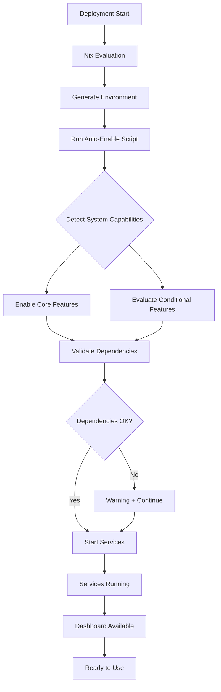

# Integration Model Architecture

**Phase 4.5: Zero Bolt-On Features**
**Status:** Implemented
**Date:** 2026-03-20
**Objective:** Comprehensive integration of all features with zero optional components

---

## Table of Contents

- [Philosophy](#philosophy)
- [Architecture Overview](#architecture-overview)
- [Feature Categories](#feature-categories)
- [Auto-Enable Mechanism](#auto-enable-mechanism)
- [Configuration vs Enabling](#configuration-vs-enabling)
- [Migration Guide](#migration-guide)
- [Developer Guide](#developer-guide)
- [Operations Guide](#operations-guide)

---

## Philosophy

### Everything Integrated

The NixOS-Dev-Quick-Deploy AI stack follows an **"everything integrated"** philosophy:

1. **No bolt-on features** - All mature features are part of core workflows
2. **Zero manual steps** - Everything works out-of-box after deployment
3. **Configuration for customization** - Not for enabling/disabling core features
4. **Auto-start services** - All services start automatically on deployment
5. **Auto-load dashboard** - All dashboard cards load automatically

### Why This Matters

**Traditional approach (bolt-on):**
```
Deploy → Manually enable features → Configure → Test → Use
         ^^^^^^^^^^^^^^^^^^^^
         Manual intervention required
```

**Our approach (integrated):**
```
Deploy → Auto-enable → Auto-configure → Ready to use
         ^^^^^^^^^^^^
         No manual steps
```

**Benefits:**
- **Faster time-to-value** - Users productive immediately
- **Consistent experience** - Same behavior across all deployments
- **Reduced errors** - No missed manual steps
- **Better testing** - Integration testing validates complete system
- **Easier maintenance** - Single code path to maintain

---

## Architecture Overview

### System Layers

```
┌─────────────────────────────────────────────────────────┐
│                    User Interface                        │
│  (Dashboard - All cards auto-load, no toggles)          │
└─────────────────────────────────────────────────────────┘
                          ↓
┌─────────────────────────────────────────────────────────┐
│              Deployment & Configuration                  │
│  • NixOS modules (declarative, always-on)               │
│  • Auto-enable script (conditional logic)               │
│  • Feature defaults (customization only)                │
└─────────────────────────────────────────────────────────┘
                          ↓
┌─────────────────────────────────────────────────────────┐
│                  Core Services                           │
│  (All auto-start on deployment)                         │
│  • Hybrid Coordinator    • Llama.cpp                    │
│  • AIDB                  • Qdrant                        │
│  • PostgreSQL            • Monitoring                    │
└─────────────────────────────────────────────────────────┘
                          ↓
┌─────────────────────────────────────────────────────────┐
│                  Integrated Features                     │
│  (Category A: Always enabled)                           │
│  • AI Harness           • Memory System                 │
│  • Context Compression  • Tree Search                   │
│  • Evaluation           • Task Classification           │
│  • Capability Discovery • Prompt Caching                │
└─────────────────────────────────────────────────────────┘
```

### Auto-Enable Flow



---

## Feature Categories

### Category A: Core Features (Always Enabled)

**Status:** ✅ Enabled by default, cannot be disabled without breaking core functionality

Features in this category are fundamental to the system:

| Feature | Purpose | Performance Impact |
|---------|---------|-------------------|
| `AI_HARNESS_ENABLED` | Core agent framework | < 1% |
| `AI_CONTEXT_COMPRESSION_ENABLED` | Token efficiency | ~2% (saves 25-35% tokens) |
| `AI_MEMORY_ENABLED` | Learning & recall | ~50ms per query |
| `AI_TREE_SEARCH_ENABLED` | Better retrieval | +200-300ms (8-12% better recall) |
| `AI_HARNESS_EVAL_ENABLED` | Quality monitoring | ~100ms (async) |
| `AI_CAPABILITY_DISCOVERY_ENABLED` | Tool discovery | ~30-50ms (cached) |
| `AI_PROMPT_CACHE_POLICY_ENABLED` | Prompt optimization | 3-5% token savings |
| `AI_TASK_CLASSIFICATION_ENABLED` | Smart routing | ~50ms |

**Configuration:** Customization parameters only (thresholds, timeouts, etc.)

**Documentation:** See `config/feature-defaults.yaml` for customization options

### Category B: Experimental Features (Manual Opt-In)

**Status:** ⚠️ Disabled by default, requires explicit opt-in

Features that are experimental or have specific requirements:

| Feature | Why Disabled | How to Enable |
|---------|-------------|---------------|
| `QUERY_EXPANSION_ENABLED` | Experimental, limited testing | `QUERY_EXPANSION_ENABLED=true` |
| `REMOTE_LLM_FEEDBACK_ENABLED` | Requires API key + costs money | Set API key + enable flag |
| `MULTI_TURN_QUERY_EXPANSION` | Incomplete implementation | Not recommended |
| `PATTERN_EXTRACTION_ENABLED` | Research use only | Enable for training environments |

**When to use:**
- Research/development environments
- Specific use cases requiring these features
- After reading documentation and understanding limitations

**Documentation:** See `docs/operations/experimental-features.md`

### Category C: Deprecated Features (Remove)

**Status:** 🗑️ To be removed from codebase

Features that are superseded or no longer needed:

| Feature | Reason | Replacement |
|---------|--------|-------------|
| `AUTO_IMPROVE_ENABLED_DEFAULT` | Superseded | `OPTIMIZATION_PROPOSALS_ENABLED` |
| `AI_HINTS_ENABLED` (aider) | Inconsistent config | Hybrid coordinator hints |
| `AI_VECTORDB_ENABLED` | Legacy variable | Nix module configuration |

**Action required:** These will be removed in a future release

### Category D: Conditional Features (Auto-Enable)

**Status:** 🔄 Auto-enable when conditions are met

Features that activate based on system capabilities:

| Feature | Conditions | Auto-Enable Logic |
|---------|-----------|-------------------|
| `AI_SPECULATIVE_DECODING_ENABLED` | Qwen/DeepSeek + 16GB RAM + GPU | Hardware detection |
| `AI_LLM_EXPANSION_ENABLED` | 4+ cores + opt-in flag | Resource check + user preference |
| `AI_CROSS_ENCODER_ENABLED` | 8GB+ RAM + opt-in flag | Resource check + user preference |

**How it works:**
1. Deployment runs `lib/deploy/auto-enable-features.sh`
2. Script detects system capabilities (CPU, RAM, GPU, model)
3. Enables features if conditions met
4. Logs decisions to report file

**Manual override:** Set environment variable to force enable/disable

---

## Auto-Enable Mechanism

### Implementation

The auto-enable system consists of:

1. **Detection script** (`lib/deploy/auto-enable-features.sh`)
   - Detects CPU cores, RAM, GPU type
   - Identifies installed model family
   - Checks Vulkan/CUDA support

2. **Nix integration** (`nix/modules/services/mcp-servers.nix`)
   - Sources auto-enable script during activation
   - Sets environment variables for services
   - Validates configuration

3. **Feature defaults** (`config/feature-defaults.yaml`)
   - Documents all features and their defaults
   - Provides customization parameters
   - Explains opt-in/opt-out mechanisms

### Detection Logic

```bash
# Example: Speculative decoding auto-enable
if [[ "${model_family}" =~ ^(qwen|deepseek)$ ]] && \
   [[ "${ram_gb}" -ge 16 ]] && \
   [[ "${gpu_type}" != "none" ]]; then
    export AI_SPECULATIVE_DECODING_ENABLED="true"
    log "✓ Enabled speculative decoding (${model_family} + ${ram_gb}GB + ${gpu_type})"
else
    log "✗ Skipped speculative decoding (insufficient resources)"
fi
```

### Override Mechanism

Users can override auto-enable decisions:

```bash
# Force enable (even if conditions not met)
export AI_SPECULATIVE_DECODING_ENABLED="true"

# Force disable (even if conditions met)
export AI_SPECULATIVE_DECODING_ENABLED="false"

# Let auto-enable decide (default)
unset AI_SPECULATIVE_DECODING_ENABLED
```

---

## Configuration vs Enabling

### Old Model (Bolt-On)

```yaml
# ❌ Old approach - feature flags for enabling
features:
  memory:
    enabled: false  # Must manually set to true
    retention_days: 30

  tree_search:
    enabled: false  # Must manually set to true
    max_depth: 2
```

**Problem:** Users must know to enable each feature

### New Model (Integrated)

```yaml
# ✅ New approach - configuration for customization
core_features:
  memory:
    # Always enabled - configuration is for customization only
    customization:
      retention_days: 30      # How long to keep memories
      collection_size: 10000  # Max number of entries

  tree_search:
    # Always enabled - configuration is for tuning
    customization:
      max_depth: 2            # How deep to search
      activation_threshold: 20 # When to use tree search
```

**Benefit:** Everything works out-of-box, users tune to their needs

### When to Use Each

**Configuration (Customization):**
- ✅ Performance tuning (timeouts, thresholds)
- ✅ Resource limits (max memory, max connections)
- ✅ Behavior preferences (strict mode, logging level)

**Feature Flags (Enabling):**
- ❌ Not used for core features (always on)
- ⚠️ Only for experimental features (explicit opt-in)
- 🔄 Conditional features (auto-enable based on capabilities)

---

## Migration Guide

### From Previous Versions

**If you're upgrading from a version with feature flags:**

1. **No action required for standard deployments**
   - All previously optional features are now auto-enabled
   - Configuration automatically migrated to new format

2. **Review custom configurations**
   - Check `~/.config/ai-stack/` for old config files
   - Old `enabled: false` settings now ignored (features auto-enable)
   - Customization parameters still respected

3. **Experimental features**
   - If you manually enabled experimental features, they stay enabled
   - Review `config/feature-defaults.yaml` for current status
   - Some experimental features may have graduated to core

### Configuration Migration

**Before (v1.0):**
```yaml
features:
  ai_harness:
    enabled: true  # Had to manually enable
    eval_interval: 300

  memory:
    enabled: false  # Disabled by default
    retention_days: 30
```

**After (v2.0 - Phase 4.5):**
```yaml
core_features:
  ai_harness:
    # Always enabled - no flag needed
    customization:
      eval_interval_seconds: 300

  memory:
    # Always enabled - no flag needed
    customization:
      retention_days: 30
```

**Migration script:**
```bash
# Run migration helper (if needed)
scripts/deploy/migrate-feature-config.sh

# Validate new configuration
scripts/testing/smoke-integration-complete.sh
```

### Backwards Compatibility

**Environment variables are preserved:**
```bash
# Old-style variables still work
export AI_MEMORY_ENABLED="true"  # Respected (though redundant)
export AI_EVAL_INTERVAL_SECONDS="600"  # Still used for customization
```

**Nix configuration is compatible:**
```nix
# Old Nix config still works
mySystem.aiHarness.enable = true;  # Redundant but harmless
mySystem.aiHarness.memory.retentionDays = 30;  # Still used
```

---

## Developer Guide

### Adding New Features

**When adding a new feature, choose the right category:**

#### Category A (Core) - Always Enabled

```python
# ✅ Correct - Core feature
AI_NEW_CORE_FEATURE = os.getenv("AI_NEW_CORE_FEATURE", "true").lower() == "true"

# Usage in code
if AI_NEW_CORE_FEATURE:  # Always true in practice
    enable_core_functionality()
```

**Checklist:**
- [ ] Feature is stable and well-tested
- [ ] Feature provides clear value to all users
- [ ] Performance impact is acceptable (< 5% latency)
- [ ] Dependencies are always available
- [ ] Feature is documented in `config/feature-defaults.yaml`
- [ ] Integration tests cover feature

#### Category B (Experimental) - Opt-In

```python
# ✅ Correct - Experimental feature
AI_EXPERIMENTAL_FEATURE = os.getenv("AI_EXPERIMENTAL_FEATURE", "false").lower() == "true"

# Usage in code
if AI_EXPERIMENTAL_FEATURE:  # Explicit opt-in required
    enable_experimental_functionality()
else:
    use_standard_path()
```

**Checklist:**
- [ ] Feature is clearly marked experimental in code comments
- [ ] Opt-in instructions in `config/feature-defaults.yaml`
- [ ] Limitations documented
- [ ] Fallback to standard behavior when disabled
- [ ] Warning logs when enabled

#### Category D (Conditional) - Auto-Enable

```bash
# ✅ Correct - Conditional feature in auto-enable script
if [[ "${cpu_cores}" -ge 8 ]] && [[ "${ram_gb}" -ge 16 ]]; then
    export AI_RESOURCE_INTENSIVE_FEATURE="true"
    log "✓ Enabled resource-intensive feature (sufficient resources)"
else
    log "✗ Skipped resource-intensive feature (need 8+ cores, 16GB+ RAM)"
fi
```

**Checklist:**
- [ ] Detection logic in `lib/deploy/auto-enable-features.sh`
- [ ] Conditions documented in `config/feature-defaults.yaml`
- [ ] Manual override mechanism available
- [ ] Decision logged in auto-enable report
- [ ] Tests for both enabled and disabled states

### Removing Feature Flags

**When a feature graduates from experimental to core:**

1. **Update default value**
   ```python
   # Before
   AI_FEATURE = os.getenv("AI_FEATURE", "false").lower() == "true"

   # After
   AI_FEATURE = os.getenv("AI_FEATURE", "true").lower() == "true"
   ```

2. **Update documentation**
   - Move from `experimental_features:` to `core_features:` in `config/feature-defaults.yaml`
   - Update opt-in instructions to indicate now enabled by default

3. **Update tests**
   - Remove opt-in setup from tests
   - Add to integration completeness test

4. **Announce in changelog**
   - Note feature is now always enabled
   - Provide opt-out instructions if needed

---

## Operations Guide

### Deployment

**Standard deployment (all features auto-enable):**
```bash
# NixOS rebuild
sudo nixos-rebuild switch --flake .

# Or quick deploy script
./nixos-quick-deploy.sh
```

**No manual steps required!** All features auto-enable and services auto-start.

### Verifying Integration

**Quick smoke test:**
```bash
scripts/testing/smoke-integration-complete.sh
```

**Comprehensive test:**
```bash
scripts/testing/test-integration-completeness.py
```

**Integration audit:**
```bash
scripts/audit/integration-audit.sh
```

### Customization

**Tuning performance:**
```nix
# In NixOS configuration
mySystem.aiHarness = {
  memory.retentionDays = 90;  # Longer memory
  eval.intervalSeconds = 600;  # Less frequent evals
  retrieval.compressionRatio = 0.25;  # More compression
};
```

**Opting out of specific features:**
```bash
# For air-gapped deployment (no web research)
export AI_WEB_RESEARCH_ENABLED="false"
export AI_BROWSER_RESEARCH_ENABLED="false"

# For minimal deployment (no telemetry)
export AI_TELEMETRY_ENABLED="false"

# Rebuild
sudo nixos-rebuild switch
```

**Opting into experimental features:**
```bash
# Enable query expansion (experimental)
export QUERY_EXPANSION_ENABLED="true"

# Enable remote LLM feedback (requires API key)
export REMOTE_LLM_FEEDBACK_ENABLED="true"
export ANTHROPIC_API_KEY="your-key-here"

# Rebuild
sudo nixos-rebuild switch
```

### Monitoring

**Check feature status:**
```bash
# Auto-enable report
cat /tmp/auto-enable-report.txt

# Or via dashboard
curl http://localhost:9090/api/status | jq '.features'
```

**Dashboard:**
- All cards load automatically
- No toggles for core features
- Experimental features show opt-in status

### Troubleshooting

**Feature not working:**

1. **Check service status**
   ```bash
   systemctl status hybrid-coordinator
   systemctl status llama-cpp
   ```

2. **Check auto-enable report**
   ```bash
   cat /tmp/auto-enable-report.txt
   ```

3. **Check environment variables**
   ```bash
   systemctl show hybrid-coordinator | grep "Environment="
   ```

4. **Run integration test**
   ```bash
   scripts/testing/test-integration-completeness.py --verbose
   ```

**Conditional feature not enabling:**

1. **Check system capabilities**
   ```bash
   # CPU cores
   nproc

   # RAM
   free -h

   # GPU
   nvidia-smi  # or rocm-smi, or check /sys/class/drm
   ```

2. **Check auto-enable logic**
   ```bash
   bash -x lib/deploy/auto-enable-features.sh
   ```

3. **Manual override**
   ```bash
   # Force enable
   export AI_FEATURE_ENABLED="true"
   sudo nixos-rebuild switch
   ```

---

## References

### Related Documentation

- **Feature Defaults:** `config/feature-defaults.yaml`
- **Auto-Enable Script:** `lib/deploy/auto-enable-features.sh`
- **Integration Audit:** `.agents/audits/bolt-on-features-audit-2026-03.md`
- **Experimental Features:** `docs/operations/experimental-features.md`
- **Customization Guide:** `docs/operations/feature-customization.md`

### Test Suites

- **Smoke Test:** `scripts/testing/smoke-integration-complete.sh`
- **Comprehensive Test:** `scripts/testing/test-integration-completeness.py`
- **Audit Script:** `scripts/audit/integration-audit.sh`

### Nix Modules

- **MCP Servers:** `nix/modules/services/mcp-servers.nix`
- **AI Stack Role:** `nix/modules/roles/ai-stack.nix`
- **Options Definition:** `nix/modules/core/options.nix`

---

## Conclusion

The **Zero Bolt-On Features** architecture ensures:

✅ **Everything works out-of-box** - No manual steps after deployment
✅ **Consistent experience** - Same behavior across all deployments
✅ **Easy customization** - Tune parameters without changing enablement
✅ **Smart auto-enable** - Features activate when appropriate
✅ **Clear opt-in for experimental** - Explicit choice for unstable features

**Philosophy:** If it's mature and tested, it's integrated. If it's experimental, it's opt-in. If it's deprecated, it's removed.

This model prioritizes **user productivity** over **configurability** for core features, while still providing **full control** over customization and experimental features.
