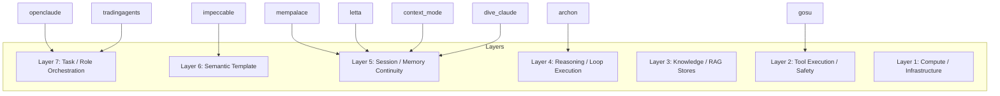
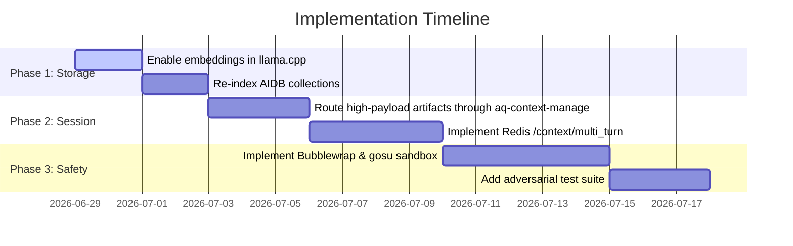

# System-Centric AI Repositories & Capability Integration Report

This report analyzes candidate repositories from recent discovery logs alongside the structural gaps identified in the **NixOS-Dev-Quick-Deploy** AI Harness. It maps each repository to specific harness layers and proposes integration strategies to close critical system gaps.

---

## 1. Core Architectural Gaps Identified

Based on recent maturity assessments and run logs, our local-first AI harness has four critical architectural gaps:

| Gap Area | Symtom / Root Cause | Operational Impact |
| :--- | :--- | :--- |
| **Memory Disconnection** | Missing LLM embedding flags (`--embeddings`) in `llama.cpp` config; stateless multi-turn session persistence. | RAG retrieval is limited to keywords; agent loops are stateless and reset context on every run. |
| **Guardrail Illusion** | Security policies are text-based (written in prompt instructions) without hard-coded sandbox/command whitelists. | High risk of destructive filesystem or terminal execution if prompts are bypassed or injected. |
| **Context Window Bloat** | Raw agent tool outputs (file listings, logs, HTML snapshots) dump directly into context. | High token spend, increased prompt latency, and performance degradation in long-running tasks. |
| **System Continuity** | Absence of an identity database and mood/temperament behavioral modulators. | Agents lack persistence of self-identity across runs and fail to embody core values programmatically. |

---

## 2. Recommended System-Centric & AI Repositories

The following repositories copy-mapped from host discovery are recommended for integration. They correspond directly to the layers of our **Layered Domain-Task Architecture**:

### A. Memory & Data Layers (Layers 3 & 5)
#### 1. **MemPalace** (`mempalace/mempalace` / `milla-jovovich/mempalace`)
*   **Core Feature:** High-density, local-first memory utilizing spatial hierarchical organization ("Method of Loci") and *verbatim* conversation/project data storage.
*   **Gap Addressed:** Resolves RAG loss-of-detail by replacing summary-based memory with structured verbatim spools.
*   **Integration Plan:** Integrate MemPalace's local SQLite/ChromaDB indexing pattern with our existing `aidb-rag-stores` to provide agents with spatial memory halls for long-term project files.

#### 2. **Mem0** (`mem0ai/mem0`) & **Letta** (`letta-ai/letta`)
*   **Core Feature:** Dynamic virtual memory paging (Letta) and long-term actor memory (Mem0).
*   **Gap Addressed:** Multi-turn session persistence and temporal retrieval.
*   **Integration Plan:** Implement Letta's memory paging primitives as a Redis-backed session helper inside `/context/multi_turn` to swap inactive agent spools out of the active context window.

---

### B. Context & Tool Optimization Layers (Layers 2 & 5)
#### 3. **context-mode** (`mksglu/context-mode`)
*   **Core Feature:** MCP server designed to sandbox raw tool outputs in subprocesses, executing scripts instead of parsing massive raw outputs.
*   **Gap Addressed:** Context window overload and high token usage during file searches, webpage reads, and test runs.
*   **Integration Plan:** Treat `context-mode` as a research-only parity target. First route high-payload commands (e.g., Playwright snapshots and CLI dumps) through the existing `aq-context-manage` and switchboard artifact compaction path. Any new MCP server install requires a separate capability-intake slice.

#### 4. **Dive into Claude Code** (`VILA-Lab/Dive-into-Claude-Code`)
*   **Core Feature:** Reverse-engineered study showing 98.4% of Claude Code consists of infrastructure: 5-layer context compaction pipeline and a 7-mode permission classifier.
*   **Gap Addressed:** Fine-grained token management and robust permission elevation hooks.
*   **Integration Plan:** Port the 5-layer context compaction design to our `hybrid-coordinator` to automatically summarize intermediate tool execution steps when approaching LLM window limits.

---

### C. Logic & Reasoning Orchestration (Layers 4 & 7)
#### 5. **Archon** (`coleam00/Archon`)
*   **Core Feature:** Declarative YAML-defined workflow engine and Git worktrees for isolated agent execution.
*   **Gap Addressed:** Flake-based evaluation bottlenecks and lack of repeatable execution graphs.
*   **Integration Plan:** Use as a design reference for our `workflow-blueprints`. Integrate Git worktree spawning in our orchestration engine to isolate local-agent execution from the active developer workspace, preventing uncommitted local pollution.

#### 6. **Strands Agents** (`strands-agents/sdk`)
*   **Core Feature:** Model-driven SDK featuring minimal agent loops, built-in planning/reflection, and native MCP support.
*   **Gap Addressed:** Over-engineered local execution loops.
*   **Integration Plan:** Standardize the local coding agent loops (`scripts/ai/delegate-to-local`) on the minimal Strands loop contract.

#### 7. **TradingAgents** (`TauricResearch/TradingAgents`)
*   **Core Feature:** Multi-agent role hierarchies (Analysts, Researchers, Fund Managers, Risk Manager) simulating professional collaborative dynamics.
*   **Gap Addressed:** Overly simplistic multi-agent delegation contracts.
*   **Integration Plan:** Adopt the risk-manager and supervisor verification flow. Wire a "reviewer/risk" agent in our `switchboard` that intercepts proposed code writes and forces testing before execution.

---

### D. Security & Harness Runtime (Layers 1 & 2)
#### 8. **gosu** (`tianon/gosu`)
*   **Core Feature:** Run-as-user tool that handles process privileges in containerized environments.
*   **Gap Addressed:** Hard privilege boundaries for agent terminal operations.
*   **Integration Plan:** Wrap `run_command` and MCP terminal tools in AppArmor/Bubblewrap sandboxes executing under a dedicated de-escalated Unix user (e.g., `nixos-ai-sandbox`), using `gosu` to drop privileges declaratively.

#### 9. **OpenClaude** (`Gitlawb/openclaude`)
*   **Core Feature:** Portable, terminal-based AI runner supporting headless gRPC execution and over 200 model backends.
*   **Gap Addressed:** Universal local/remote API fallbacks and headless CI/CD execution.
*   **Integration Plan:** Enable the gRPC service mode as a secondary local agent provider under the `switchboard`.

---

## 3. High-Value Action Items (Next Phase)

1.  **Phase A (Embeddings):** Enable the `--embeddings` parameter in our `llama-cpp` NixOS backend configuration (`nix/modules/roles/ai-stack.nix`) and execute `populate-knowledge-from-web.py` to activate semantic RAG search.
2.  **Phase B (Context Sandboxing):** Route high-payload terminal, Playwright, and file outputs through the existing `aq-context-manage` and switchboard artifact compaction path; keep `mksglu/context-mode` research-only until capability-intake approves a new MCP runtime.
3.  **Phase C (Sandboxed Execution):** Create a sandboxed execution wrapper using `bubblewrap` and `gosu` to contain local agent scripts, closing the "Guardrail Illusion" security gap.
