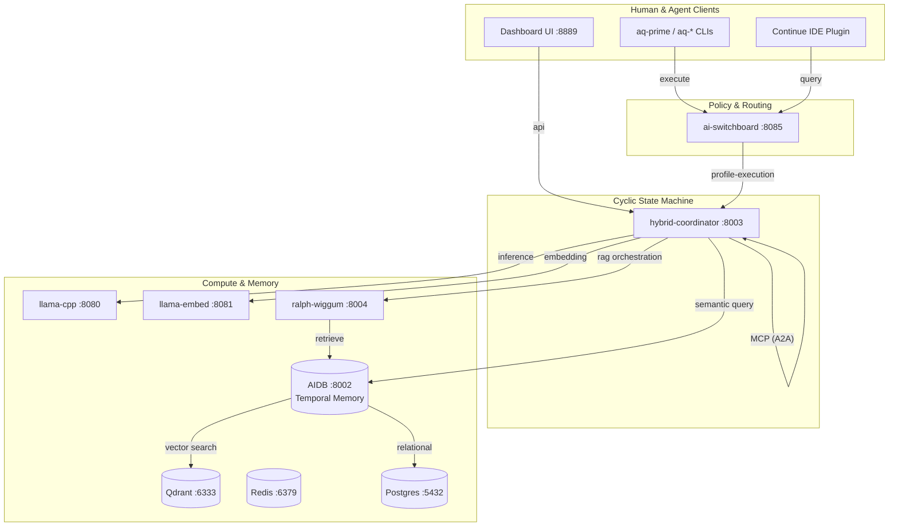
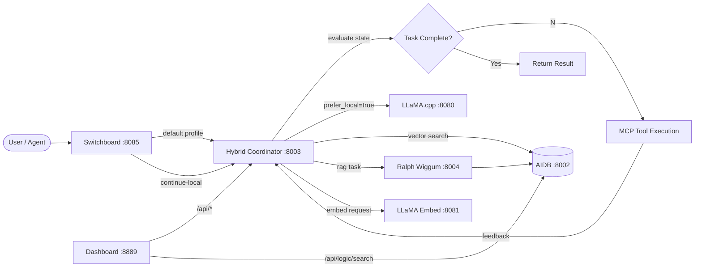
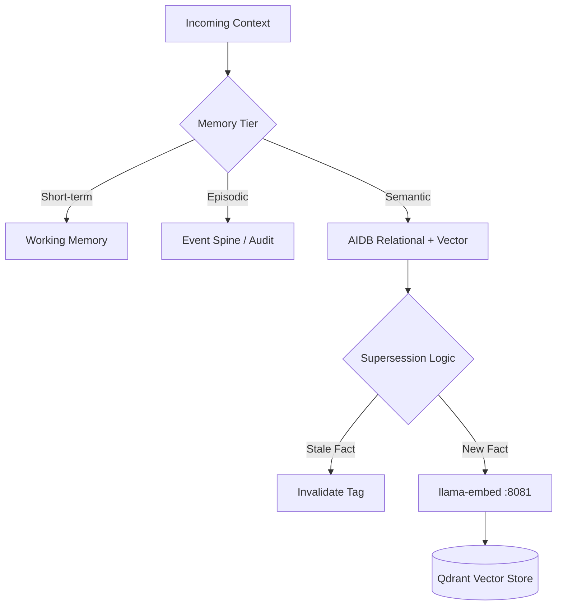

# Architecture Diagrams
Status: Active
Owner: AI Stack Maintainers
Last Updated: 2026-05-14

## Agentic AI Operating System (AI OS) Architecture

The NixOS-Dev-Quick-Deploy stack operates as a foundational "AI Operating System," treating the LLM as the CPU, context windows as working RAM, and persistent vector/graph stores as long-term storage.

### 1. High-Level AI OS Topology

### 2. Request Routing Flow (Cyclic DAG)

The system is migrating from a linear fallback model to a cyclic, state-driven orchestration model (Agentic Mesh) leveraging the Model Context Protocol (MCP) as the standard Agent-to-Agent (A2A) networking layer.

### 3. Foundation Persistence (Temporal Memory)

Memory relies on "supersession logic" (temporal knowledge graphs) to manage stale facts, shifting from simple bolt-on RAG to crystalline memory.

---
*Note: K3s, Podman, and linear legacy pipelines have been fully deprecated in favor of this host-local, declarative NixOS systemd-native AI OS architecture.*